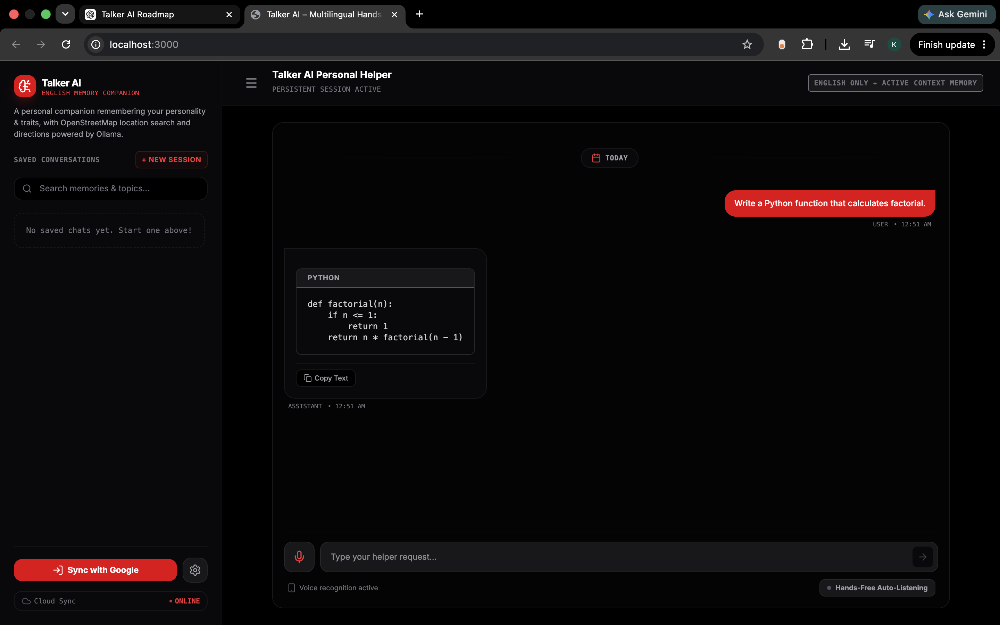
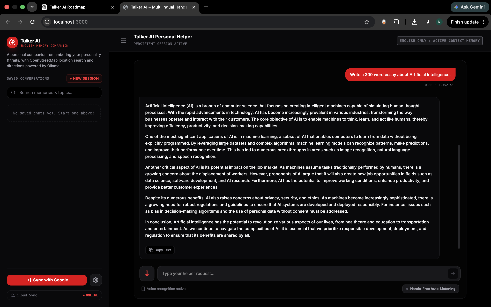
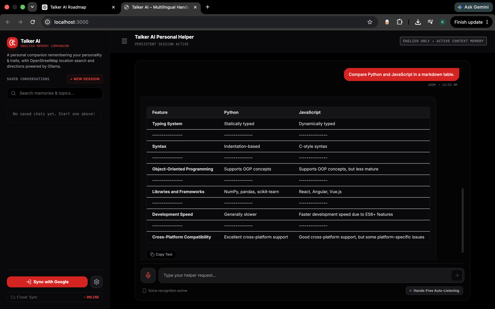
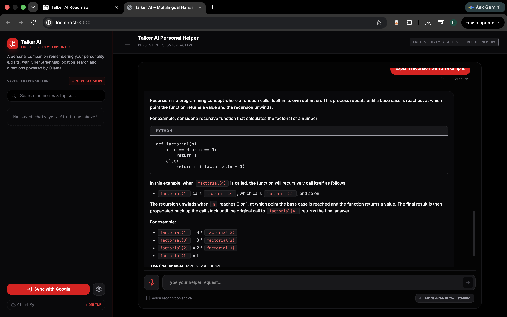
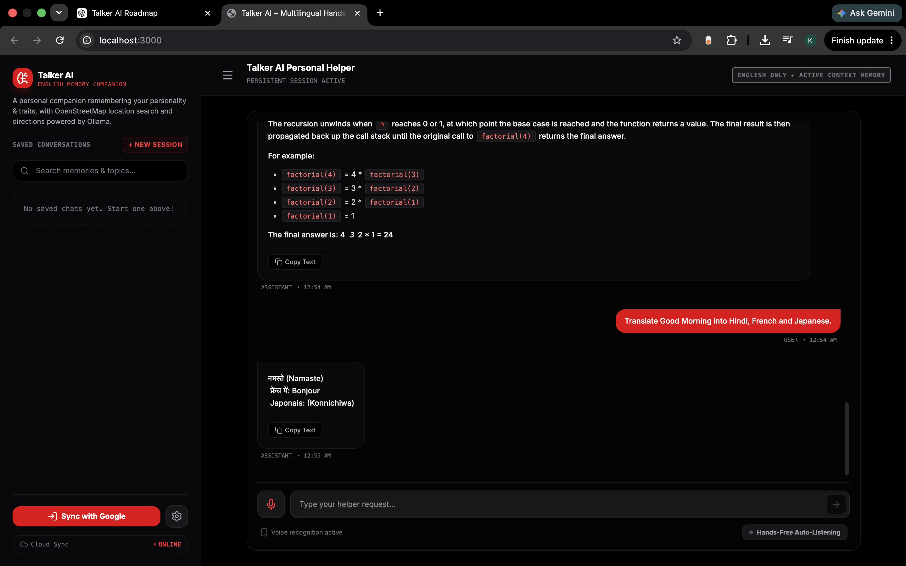

# Talker AI Assistant

**Full‑stack AI assistant powered by React, TypeScript, Express, and Ollama**

Talker AI Assistant is a modern, production‑ready conversational AI platform that runs locally using Ollama’s large language models. It provides a seamless chat experience with voice interaction, real‑time streaming, and rich markdown rendering, all while keeping user data synchronized via Firebase.

Built to give developers and teams a privacy‑first, extensible solution, the project combines a responsive React UI with a robust Express backend. It enables offline AI capabilities, integrates OpenStreetMap for location‑based features, and supports authentication and data persistence without external API costs.

### Key Features
- Local LLM with Ollama
- Streaming chat
- Markdown & syntax‑highlighted code rendering
- Conversation memory
- Voice interaction
- Firebase Authentication & Firestore sync
- OpenStreetMap integration
- Modular backend architecture
- Responsive React UI

## Tech Stack

| Category | Technologies |
|----------|--------------|
| Frontend | React 19, TypeScript, Vite, Tailwind CSS |
| Backend | Express.js, Node.js |
| AI | Ollama (Llama 3.2) |
| Authentication | Firebase Authentication |
| Database | Cloud Firestore |
| Maps | OpenStreetMap, Leaflet, Nominatim, OSRM |
| Language | TypeScript |

## Screenshots

### Python Code Generation



---

### Essay Generation



---

### Markdown Table Rendering



---

### Recursion Explanation



---

### Translation



#### Demo
*(Add demo link or GIF here)*

---

## Architecture

```
PRESENTATION: React 19 · Tailwind CSS 4 · Leaflet · Web Speech API
       ↓  REST APIs + Firestore Sync
CUSTOM HOOKS: useChatManager · useVoiceAssistant · useAuthAndProfile
       ↓  POST /api/*
EXPRESS BACKEND: Routes → AI → Utils → Middleware
       ↓
EXTERNAL: Ollama (local LLM) · Firebase (Auth + Firestore) · OSM/Nominatim/OSRM
```

---

## Quick Start

### Prerequisites
- Node.js v18+
- [Ollama](https://ollama.ai/) running (`ollama serve`)
- An Ollama model pulled (`ollama pull llama3.2:3b`)

### Setup
```bash
npm install
cp .env.example .env
npm run dev
```

### Build for production
```bash
npm run build
npm start
```

---

## Environment Variables

| Variable     | Default                    | Description                      |
|--------------|----------------------------|----------------------------------|
| PORT         | 3000                       | Backend HTTP port                |
| NODE_ENV     | development                | development or production        |
| OLLAMA_URL   | http://127.0.0.1:11434     | Ollama server URL                |
| OLLAMA_MODEL | llama3.2:3b                | Model name                       |

---

## API Reference

| Endpoint | Method | Description |
|----------|--------|-------------|
| /health  | GET    | Liveness probe (200) |
| /ready   | GET    | Readiness probe (200 / 503) |
| /version | GET    | Build metadata |
| /api/chat | POST  | Send a message (streaming or regular) |
| /api/summarize | POST | Generate session title |
| /api/tts | POST   | Text-to-speech fallback |

---

## Project Structure

```
shared/types.ts      — Shared domain types (API contracts, Persona, MapAction)
server/config/       — Centralised typed config + version
server/ai/           — LLM logic (Ollama provider, prompts, parser, summarize)
server/routes/       — Express route handlers (chat, summarize, tts, health)
server/middleware/   — Global error handler + API 404
server/utils/        — Logger, errors, retry, validation
src/                 — React frontend (components, hooks, lib, maps)
```

---

## License

MIT

