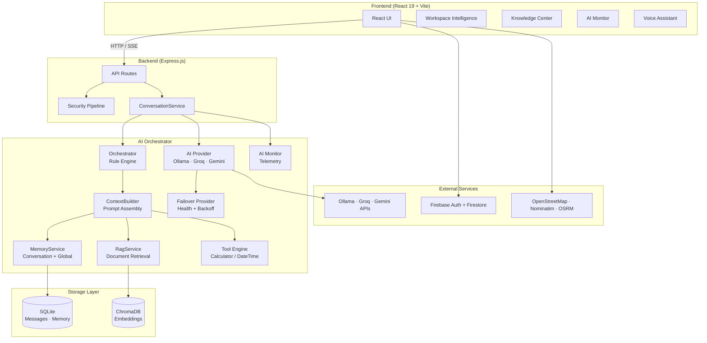
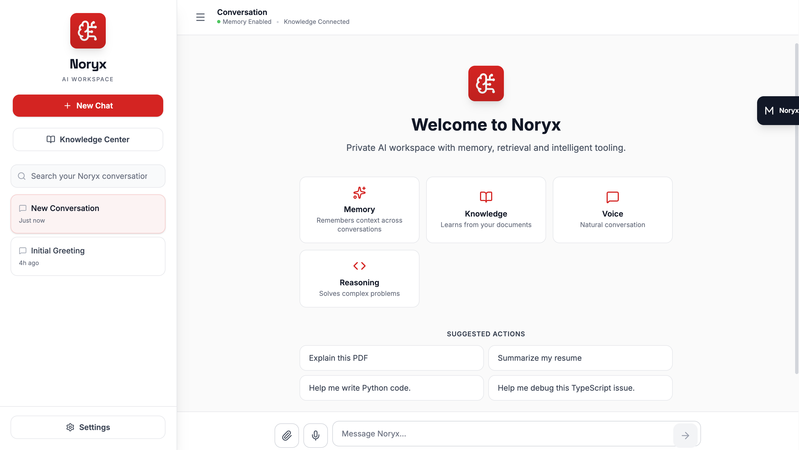
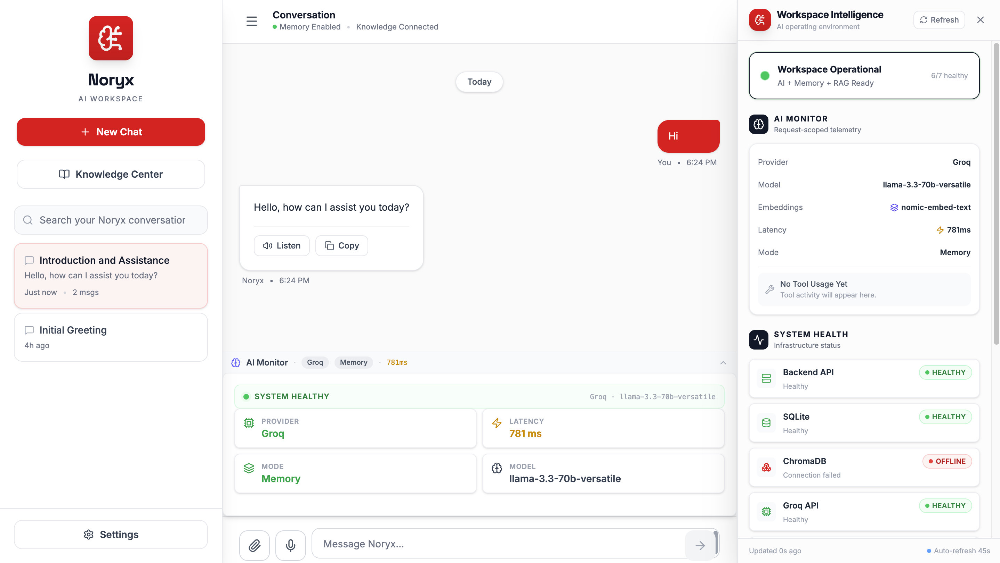
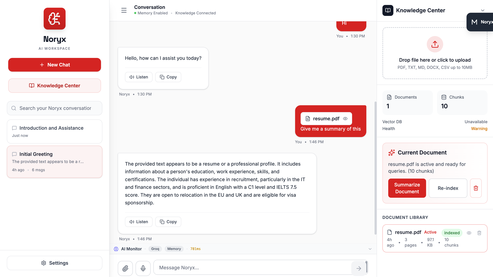
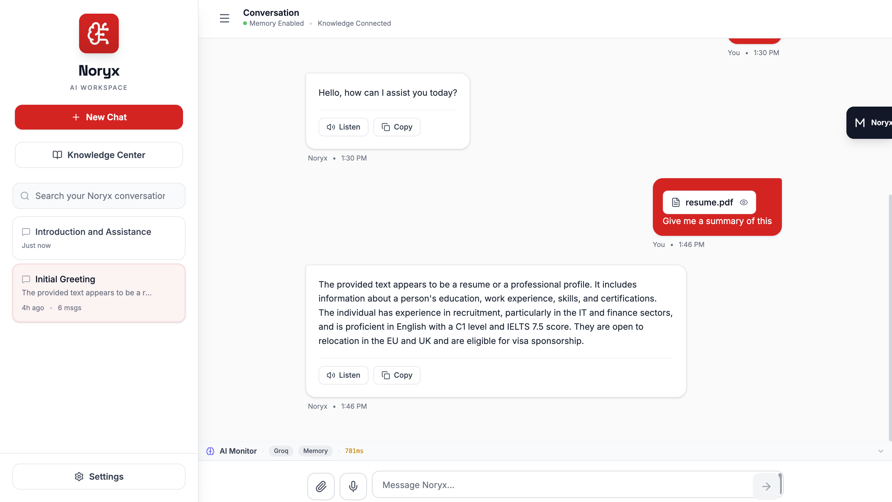
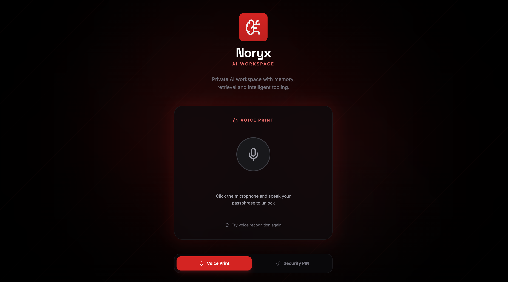
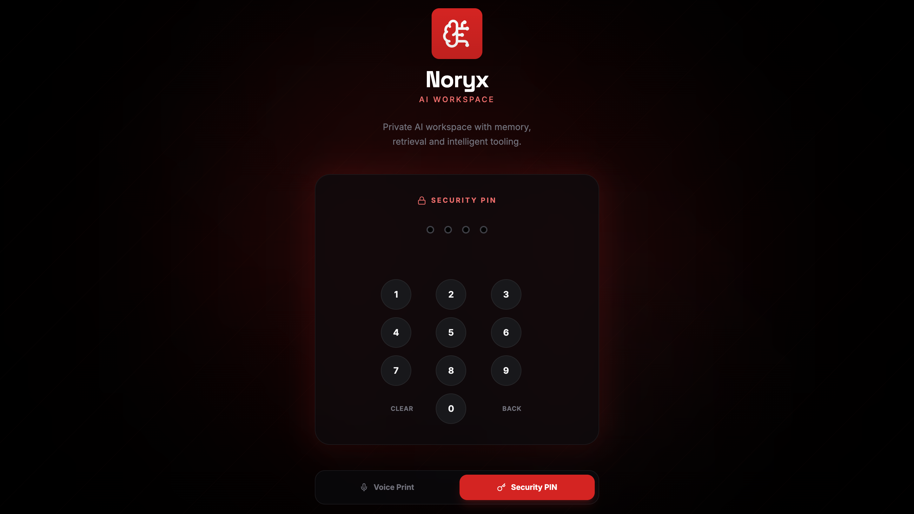

<div align="center">
  <h1>
    
  </h1>
  <h3>Enterprise‑grade AI Workspace</h3>
  <p>
    <b>Multi‑provider LLM orchestration</b> · <b>Retrieval‑Augmented Generation</b> · <b>Persistent Memory</b><br>
    <b>Streaming Responses</b> · <b>Voice Interaction</b> · <b>Workspace Intelligence</b> · <b>Production‑Grade Security</b>
  </p>
  <br>
  <p>
    <a href="https://noryx.onrender.com/"><code>🌐 Live Demo</code></a>
    &nbsp;&nbsp;
    <a href="#-quick-start"><code>🚀 Quick Start</code></a>
    &nbsp;&nbsp;
    <a href="docs/README.md"><code>📚 Documentation</code></a>
    &nbsp;&nbsp;
    <a href="#-architecture-overview"><code>🏗️ Architecture</code></a>
  </p>
  <br>
  <p>
    
    
    
    
    
    
    
    
    
    
  </p>
</div>

---

## 📋 Project Overview

**Noryx** is not a chatbot. It is a **full‑stack AI Workspace** — a production‑ready platform where users converse, query documents, persist knowledge, and orchestrate AI models through a unified, secure interface.

| Concept | What it means |
|---------|---------------|
| **🧠 AI Workspace** | A unified environment for conversations, documents, memory, and tools — not a single‑purpose chat window. |
| **🔀 Multi‑provider architecture** | Seamless orchestration across **Ollama** (local), **Groq** (cloud), and **Gemini** (cloud) with automatic failover. No single‑provider lock‑in. |
| **📄 Document intelligence** | Upload PDFs and text files. Indexed into **ChromaDB** with attachment‑scoped RAG that never leaks across documents. |
| **🧩 Persistent memory** | Conversation history + global Q&A memory stored in **SQLite**. Remembers across sessions without external vector databases. |
| **💡 Workspace intelligence** | Sidebar surfacing conversation summaries, active document context, and memory‑driven insights — turning chat history into actionable knowledge. |
| **📊 AI Monitor** | Per‑request telemetry: provider, latency, mode (memory/RAG/tools/security), and response metadata — full observability into every AI interaction. |
| **🔒 Security** | Centralised pipeline: input sanitisation, content filtering, prompt‑injection detection, file validation, rate limiting, secret auditing, and telemetry. Every request is hardened. |

---

## ✨ Key Features

### AI

| Feature | Description |
|---------|-------------|
| **Multi‑provider LLM orchestration** | Routes requests across Ollama, Groq, and Gemini with configurable priority and automatic failover. |
| **Deterministic orchestrator** | Rule‑engine routing (memory / RAG / tools) — no LLM calls wasted on deciding what to do. |
| **Streaming responses** | Real‑time SSE streaming with provider failover mid‑stream. |
| **Context builder** | Assembles system prompt, history, memory, RAG context, and tool results within a configurable token budget. |
| **Tool engine** | Calculator and datetime tools with deterministic planning and execution. |

### Knowledge

| Feature | Description |
|---------|-------------|
| **Retrieval‑Augmented Generation (RAG)** | Semantic search over uploaded documents using ChromaDB + embeddings. |
| **Attachment‑scoped retrieval** | RAG context scoped to the active document — no cross‑document leakage. |
| **PDF & text ingestion** | Upload PDFs or plain text; automatic chunking, embedding, and indexing. |
| **Global memory** | Site‑wide Q&A memory persists across all conversations. |
| **Conversation memory** | Per‑conversation history with automatic title generation. |

### Developer Experience

| Feature | Description |
|---------|-------------|
| **Full‑stack TypeScript** | End‑to‑end type safety from `shared/types.ts` through backend to React frontend. |
| **Vite + HMR** | Lightning‑fast development with hot module replacement. |
| **SQLite migrations** | Versioned schema migrations with status and rollback support. |
| **Comprehensive documentation** | Architecture, AI, backend, frontend, security, API, data flow, developer guide, and deployment docs. |
| **Modular architecture** | Clear separation: routes → services → providers → storage. |

### Security

| Feature | Description |
|---------|-------------|
| **Input sanitisation** | Strips control characters, invisible Unicode, BIDI overrides; enforces length and newline limits. |
| **Content filtering** | Input + output filtering with severity scoring across multiple categories. |
| **Prompt‑injection detection** | Flags, scores, and strips injection attempts in user text and RAG documents. |
| **File validation** | MIME type, extension, size, and duplicate detection for uploaded documents. |
| **Rate limiting** | Per‑client request throttling with configurable limits. |
| **Secret auditing** | Startup audit of environment secrets and configuration. |
| **Security telemetry** | Request‑scoped security event collection for observability. |

### User Experience

| Feature | Description |
|---------|-------------|
| **Voice interaction** | Speech‑to‑text input and text‑to‑speech output via Web Speech API. |
| **Rich markdown rendering** | Syntax‑highlighted code blocks, tables, math, and more. |
| **Workspace Intelligence sidebar** | Conversation summaries, active document context, and memory insights. |
| **Knowledge Center** | Centralised document management with upload, preview, and deletion. |
| **AI Monitor panel** | Real‑time visibility into provider, latency, mode, and security events. |
| **Conversation management** | Session strip with create, switch, delete, and auto‑generated titles. |
| **Lock screen** | Privacy screen with PIN authentication. |
| **Responsive design** | Tailwind CSS — works on desktop and mobile. |

---

## 🏗️ Architecture Overview


```mermaid
flowchart TB
    subgraph Frontend["Frontend (React 19 + Vite)"]
        UI[React UI]
        WS[Workspace Intelligence]
        KC[Knowledge Center]
        AM[AI Monitor]
        Voice[Voice Assistant]
    end

    subgraph Backend["Backend (Express.js)"]
        Routes[API Routes]
        Conv[ConversationService]
        Sec[Security Pipeline]
    end

    subgraph AI["AI Orchestrator"]
        Orch[Orchestrator<br/>Rule Engine]
        Ctx[ContextBuilder<br/>Prompt Assembly]
        Mem[MemoryService<br/>Conversation + Global]
        Rag[RagService<br/>Document Retrieval]
        Tools[Tool Engine<br/>Calculator / DateTime]
        Prov[AI Provider<br/>Ollama · Groq · Gemini]
        Fail[Failover Provider<br/>Health + Backoff]
        Mon[AI Monitor<br/>Telemetry]
    end

    subgraph Storage["Storage Layer"]
        SQL[(SQLite<br/>Messages · Memory)]
        CH[(ChromaDB<br/>Embeddings)]
    end

    subgraph External["External Services"]
        LLM[Ollama · Groq · Gemini APIs]
        Firebase[Firebase Auth + Firestore]
        OSM[OpenStreetMap · Nominatim · OSRM]
    end

    UI -->|HTTP / SSE| Routes
    Routes --> Sec
    Routes --> Conv
    Conv --> Orch --> Ctx
    Ctx --> Mem
    Ctx --> Rag
    Ctx --> Tools
    Conv --> Prov
    Prov --> Fail
    Conv --> Mon
    Mem --> SQL
    Rag --> CH
    Prov --> LLM
    UI --> Firebase
    UI --> OSM
```

### Request Flow

```
User Message → Security Pipeline → ConversationService → Orchestrator (rule engine)
  → ContextBuilder (memory + RAG + tools + history)
  → AI Provider (with failover)
  → Response (streaming or JSON)
  → AI Monitor (telemetry)
  → Persist (SQLite)
```

---

## 📸 Screenshots

### Home Dashboard



*Full application layout with active conversation, workspace sidebar, and AI Monitor panel — the central hub of the Noryx AI Workspace.*

---

### AI Monitor & Workspace Intelligence



*Per‑request telemetry showing provider, latency, mode (memory/RAG/tools/security), and response metadata — full observability into every AI interaction.*

---

### Knowledge Center



*Centralised document management with upload, preview, and deletion — index PDFs and text files for semantic retrieval.*

---

### Document RAG Workflow



*Upload PDFs and text files — Noryx indexes and retrieves semantically relevant content for context‑aware, attachment‑scoped answers.*

---

### Voice Authentication



*Speech‑to‑text input and text‑to‑speech output via Web Speech API, with voice configuration settings.*

---

### Security PIN Authentication



*Privacy lock screen with PIN authentication — securing the workspace when unattended.*

---

## 🛠️ Technology Stack

| Layer | Technologies |
|-------|-------------|
| **Frontend** | React 19, TypeScript, Vite, Tailwind CSS 4, Leaflet, Web Speech API |
| **Backend** | Express.js, Node.js, TypeScript, Better‑SQLite3, LangChain |
| **AI** | Ollama (local), Groq (cloud), Gemini (failover), ChromaDB, Custom orchestrator, Context builder |
| **Storage** | SQLite (messages, memory, metadata), ChromaDB (embeddings), Firebase Firestore (auth sync) |
| **Security** | InputSecurityService, ContentFilterService, PromptInjectionDetector, FileValidationService, RateLimiter, SecretAuditService, SecurityTelemetry |
| **Infrastructure** | Render (hosting), Firebase (auth + sync), OpenStreetMap (location services) |

---

## 📁 Project Structure

```
noryx/
├── shared/                    # Shared domain types
│   └── types.ts               #   API contracts, Persona, MapAction
│
├── server/                    # Backend (Express.js)
│   ├── server.ts              #   Entry point, middleware, startup
│   ├── config/                #   Typed environment configuration
│   ├── db/                    #   SQLite + migrations
│   ├── routes/                #   HTTP route handlers
│   │   ├── chat.ts            #     Streaming + non‑streaming chat
│   │   ├── conversations.ts   #     Conversation CRUD
│   │   ├── rag.ts             #     Document upload + retrieval
│   │   ├── health.ts          #     Health / readiness probes
│   │   ├── summarize.ts       #     Title generation
│   │   └── tts.ts             #     Text‑to‑speech
│   ├── ai/                    #   AI pipeline
│   │   ├── provider.ts        #     Provider abstraction
│   │   ├── ollama.ts          #     Ollama provider
│   │   ├── groq.ts            #     Groq provider
│   │   ├── gemini.ts          #     Gemini provider (failover)
│   │   ├── failover.ts        #     Multi‑provider failover
│   │   ├── orchestrator/      #     Deterministic rule engine
│   │   ├── context/           #     Prompt assembly + token budget
│   │   ├── conversation/      #     Conversation orchestration
│   │   ├── rag/               #     Embeddings, retriever, vector store
│   │   ├── tools/             #     Calculator, datetime, registry
│   │   └── monitor/           #     Request‑scoped telemetry
│   ├── memory/                #   Conversation + global memory
│   ├── security/              #   Centralised security services
│   ├── middleware/            #   Error handling
│   ├── services/              #   Health service
│   └── utils/                 #   Logger, errors, retry, validation
│
├── src/                       # Frontend (React 19 + Vite)
│   ├── App.tsx                #   Root component
│   ├── main.tsx               #   Entry point
│   ├── components/            #   UI components
│   │   ├── ChatViewport.tsx   #     Main chat interface
│   │   ├── MessageItem.tsx    #     Message bubble with markdown
│   │   ├── MarkdownRenderer.tsx #   Rich markdown + code highlighting
│   │   ├── ChatSessionsStrip.tsx # Conversation management
│   │   ├── WorkspaceIntelligenceSidebar.tsx # Insights sidebar
│   │   ├── KnowledgeCenter.tsx #   Document management
│   │   ├── AIMonitorPanel.tsx #     AI telemetry panel
│   │   ├── VoiceSettings.tsx  #     Voice configuration
│   │   ├── LockScreen.tsx     #     Privacy lock screen
│   │   ├── DocumentInsightsModal.tsx # Document analysis
│   │   ├── DocumentPreviewDrawer.tsx # Document preview
│   │   ├── AttachmentChip.tsx #     File attachment display
│   │   ├── AttachmentMessageBubble.tsx # Attachment in messages
│   │   ├── InteractiveMap.tsx #     Map component
│   │   ├── LanguageBadge.tsx  #     Language indicator
│   │   ├── Logo.tsx           #     Brand logo
│   │   ├── RagIndicator.tsx   #     RAG status indicator
│   │   ├── Skeleton.tsx       #     Loading skeletons
│   │   └── SystemHealthPanel.tsx #  System status
│   ├── hooks/                 #   Custom React hooks
│   ├── lib/                   #   API client, utilities
│   └── maps/                  #   Map providers, geocoding, routing
│
├── docs/                      # Engineering documentation
│   ├── Architecture/          #   System architecture
│   ├── AI/                    #   AI pipeline deep‑dive
│   ├── Backend/               #   Backend internals
│   ├── Frontend/              #   Frontend component hierarchy
│   ├── Security/              #   Security architecture
│   ├── Reference/             #   API reference
│   ├── DataFlow/              #   Data flow diagrams
│   ├── Developer/             #   Developer guide
│   └── Deployment/            #   Deployment guide
│
├── storage/                   # SQLite database files
└── assets/                    # Static assets
```

---

## 🚀 Quick Start

### Prerequisites

- **Node.js** v18 or later
- **npm** v9 or later
- **Ollama** (for local AI) — [install guide](https://ollama.ai/download)
- A **Firebase** project (for authentication) — [optional, see config](docs/Developer/DEVELOPER_GUIDE.md)

### Installation

```bash
# Clone the repository
git clone https://github.com/vickyrocks392-rgb/Talker-AI-Assistant.git
cd Talker-AI-Assistant

# Install dependencies
npm install

# Copy environment configuration
cp .env.example .env
```

### Running (Development)

```bash
# Start Ollama (if using local models)
ollama serve
ollama pull llama3.2:3b

# Start the development server
npm run dev
```

The application will be available at `http://localhost:3000`.

### Running (Production)

```bash
# Build the application
npm run build

# Start the production server
npm start
```

### Database Migrations

```bash
# Run pending migrations
npm run migrate

# Check migration status
npm run migrate:status
```

---

## 📚 Documentation

Noryx features world‑class engineering documentation designed so an experienced AI Engineer can understand the entire architecture **without reading the source code**.

| Area | Document | What it covers |
|------|----------|----------------|
| **System** | [System Architecture](docs/Architecture/SYSTEM_ARCHITECTURE.md) | High‑level architecture, component responsibilities, request / streaming / conversation lifecycles, Workspace Intelligence, AI Monitor, Security layer, Knowledge Center. |
| **AI** | [AI Architecture](docs/AI/AI_ARCHITECTURE.md) | Provider layer, orchestrator, context builder, memory, RAG, embeddings, retriever, token budget, streaming, voice, prompt assembly, security pipeline, AI Monitor, with Mermaid request‑flow diagrams. |
| **Backend** | [Backend Guide](docs/Backend/BACKEND.md) | Folder structure, services, routes, middleware, repositories, utilities, configuration, startup process, dependency graph. |
| **Frontend** | [Frontend Guide](docs/Frontend/FRONTEND.md) | Component hierarchy, application state, streaming UI, conversation flow, Workspace Intelligence, Knowledge Center, AI Monitor, Voice, Lock Screen. |
| **Security** | [Security Architecture](docs/Security/SECURITY.md) | Input security, output filtering, prompt injection, RAG protection, file validation, rate limiting, secret audit, telemetry, threat model, trust boundaries. |
| **API** | [API Reference](docs/Reference/API.md) | Every public endpoint: method, route, purpose, request, response, streaming behaviour, possible errors. |
| **Data Flow** | [Data Flow Diagrams](docs/DataFlow/DATA_FLOW.md) | Mermaid diagrams for User→AI, User→RAG, User→Memory, Document Upload, Streaming, Voice, Knowledge Retrieval, Security Pipeline. |
| **Developer** | [Developer Guide](docs/Developer/DEVELOPER_GUIDE.md) | Install, run, environment variables, dev workflow, debugging, adding a provider / tool / memory / RAG feature. |
| **Deployment** | [Deployment Guide](docs/Deployment/DEPLOYMENT.md) | Build, production serving, environment configuration, ChromaDB, external services. |

### Supporting Reference Docs

| Document | Description |
|----------|-------------|
| [Provider Failover](docs/PROVIDER_FAILOVER.md) | Multi‑provider failover design with health tracking and exponential backoff. |
| [Streaming Failover Fix](docs/STREAMING_FAILOVER_FIX.md) | How streaming errors trigger provider retry mid‑stream. |
| [Retrieval Architecture Verification](docs/RETRIEVAL_ARCHITECTURE_VERIFICATION.md) | Attachment‑scoped RAG invariants and verification. |
| [Database Migrations](docs/database-migrations.md) | SQLite migration system and schema versioning. |

---

## 🎯 Why Noryx?

### Engineering Goals

Noryx was built to answer a fundamental question: *What does a production‑ready AI workspace look like when engineered with the same rigour as a financial trading system?*

| Principle | Implementation |
|-----------|----------------|
| **Deterministic orchestration** | Routing decisions (memory / RAG / tools) are made by a rule engine, never by an LLM call. This makes behaviour predictable, testable, and cheap. |
| **Separation of concerns** | Routes are thin HTTP controllers; business logic lives in services; security is centralised. Each layer has a single responsibility. |
| **Graceful degradation** | Provider failures, parse errors, and unavailable RAG fall back instead of crashing. The system degrades gracefully under load or partial outage. |
| **Security by default** | Every request passes through input sanitisation, content filtering, and telemetry collection. Security is not an afterthought — it is baked into the request lifecycle. |
| **Backend is source of truth** | The frontend never stores messages or documents locally. It always fetches from the API, ensuring consistency and auditability. |
| **End‑to‑end TypeScript** | Shared types flow from `shared/types.ts` through the backend to the React frontend. Type mismatches are caught at compile time, not runtime. |

### Architectural Philosophy

- **Monolithic by default, modular by design.** A single process keeps deployment simple, while clear module boundaries (routes → services → providers → storage) ensure the codebase remains navigable as it grows.
- **Observability is a first‑class concern.** The AI Monitor captures per‑request telemetry (provider, latency, mode, memory/RAG/tool/security usage) and surfaces it to both the frontend and logs.
- **Failover is not optional.** With three AI providers (Ollama, Groq, Gemini) and automatic failover with health tracking, Noryx never depends on a single point of failure.
- **RAG is attachment‑scoped.** Document retrieval is scoped to the active document — no cross‑document leakage, no irrelevant context, no prompt bloat.

---

## 🔭 Future Vision

Noryx is architected to evolve from a single‑user AI workspace into a distributed intelligence platform. The following pillars guide its long‑term evolution:

| Pillar | Description |
|--------|-------------|
| **🏢 Multi‑Tenant Intelligence** | Team workspaces, role‑based access control, and shared knowledge bases — enabling organisations to deploy Noryx as their internal AI hub. |
| **🔗 Agentic Workflows** | Autonomous agents that can plan, execute sub‑tasks, verify results, and iterate — within the existing security and observability framework. |
| **🧬 Hybrid Retrieval** | Dense + sparse (BM25) retrieval with re‑ranking for higher precision on domain‑specific queries while maintaining recall on open‑ended questions. |
| **🛡️ Enterprise Readiness** | SSO/SAML authentication, SOC 2‑compliant audit logging, on‑premise deployment via Docker Compose, and compliance reporting. |
| **🧪 Code Execution Sandbox** | A secure sandbox for Noryx to write, execute, and verify code in isolated environments — transforming it from conversational AI into an interactive development assistant. |
| **🎙️ Multimodal Interaction** | Image understanding, document vision (OCR + layout analysis), and real‑time audio streaming — building on existing voice support. |

---

## 🙏 Acknowledgements

Noryx stands on the shoulders of incredible open‑source projects and communities:

- **[React](https://react.dev)** & **[Vite](https://vitejs.dev)** — The frontend foundation
- **[Express.js](https://expressjs.com)** — Reliable, minimalist web framework
- **[Ollama](https://ollama.ai)** — Local LLM inference made simple
- **[Groq](https://groq.com)** — Blazing‑fast cloud inference
- **[ChromaDB](https://www.trychroma.com)** — Open‑source vector database
- **[Better‑SQLite3](https://github.com/WiseLibs/better-sqlite3)** — Synchronous, performant SQLite
- **[LangChain](https://langchain.com)** — Embedding and vector store integrations
- **[Tailwind CSS](https://tailwindcss.com)** — Utility‑first CSS framework
- **[Leaflet](https://leafletjs.com)** & **[OpenStreetMap](https://www.openstreetmap.org)** — Free, open map ecosystem
- **[Firebase](https://firebase.google.com)** — Authentication and cloud sync
- **[shields.io](https://shields.io)** — Beautiful badge generation

---

<p align="center">
  <b>Built with ❤️ for AI engineers who demand production‑grade quality.</b>
  <br><br>
  <a href="https://talker-ai-assistant.onrender.com">🌐 Live Demo</a>
  &nbsp;·&nbsp;
  <a href="docs/README.md">📚 Documentation</a>
  &nbsp;·&nbsp;
  <a href="https://github.com/vickyrocks392-rgb/Talker-AI-Assistant/issues">🐛 Report Bug</a>
  &nbsp;·&nbsp;
  <a href="https://github.com/vickyrocks392-rgb/Talker-AI-Assistant/discussions">💬 Discussion</a>
</p>

<p align="center">
  <sub>MIT License · Copyright © 2026 Noryx</sub>
</p>