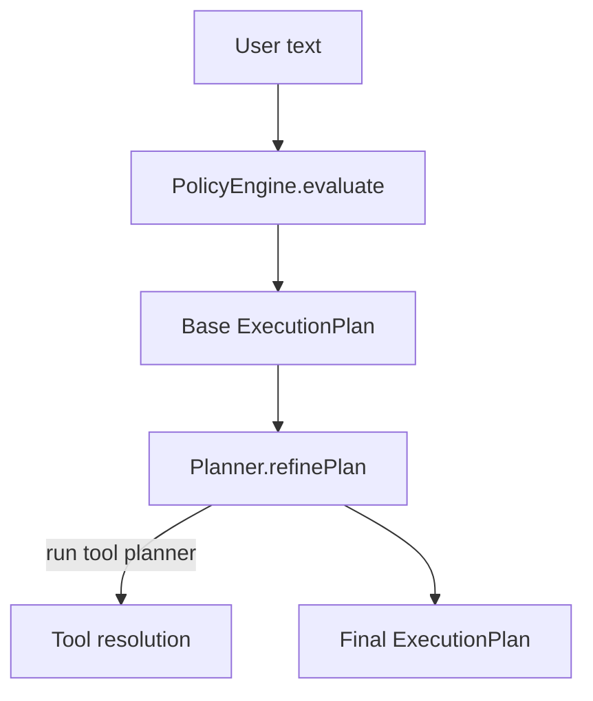
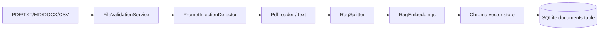
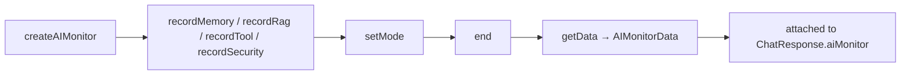

# AI Architecture

This document describes the AI subsystem of **Noryx** in depth: the provider layer, orchestrator, context builder, memory, RAG, embeddings, retriever, token budget, streaming, voice, prompt assembly, security pipeline, and AI Monitor.

- System overview: [../Architecture/SYSTEM_ARCHITECTURE.md](../Architecture/SYSTEM_ARCHITECTURE.md)
- Data flow diagrams: [../DataFlow/DATA_FLOW.md](../DataFlow/DATA_FLOW.md)
- Security: [../Security/SECURITY.md](../Security/SECURITY.md)

---

## 1. Layered pipeline

```mermaid
flowchart LR
    Req[User Request] --> Orchestrator
    Orchestrator -->|ExecutionPlan| Ctx[ContextBuilder]
    Ctx -->|OllamaMessage[]| Provider[AI Provider]
    Provider -->|replyText| Parse[Parser]
    Parse --> Resp[Response + Monitor]

    Ctx -.-> Memory[MemoryService]
    Ctx -.-> Rag[RagService]
    Ctx -.-> Tools[Tool Engine]
    Memory --> SQLite[(SQLite)]
    Rag --> Chroma[(ChromaDB)]
```

The pipeline is **deterministic up to the provider call**. Routing (memory/RAG/tools) is decided by a rule engine, not by the LLM.

---

## 2. Provider Layer

**Files:** `server/ai/provider.ts`, `ollama.ts`, `groq.ts`, `gemini.ts`, `failover.ts`, `types.ts`

All providers implement the `AIProvider` interface:

```ts
interface AIProvider {
  chat(request: { messages: OllamaMessage[] }): Promise<ModelResponse>;
  chatStream(request: { messages: OllamaMessage[] }): AsyncIterable<ModelStreamChunk>;
  summarize(messages: OllamaMessage[]): Promise<string>;
}
```

- `getAIProvider()` returns a singleton. If `AI_FAILOVER_ENABLED !== "false"`, it returns a `FailoverProvider` that tries providers in `AI_PROVIDER_PRIORITY` order (default `groq,gemini,ollama`) with health tracking and exponential backoff.
- Otherwise it returns the single provider named by `AI_PROVIDER` (`ollama` or `groq`).
- `gemini.ts` exists for failover even though `AI_PROVIDER` only accepts `ollama`/`groq` — it is reachable via the failover chain.

See [../PROVIDER_FAILOVER.md](../PROVIDER_FAILOVER.md) and [../STREAMING_FAILOVER_FIX.md](../STREAMING_FAILOVER_FIX.md) for failover design details.

---

## 3. Conversation Orchestrator

**Files:** `server/ai/orchestrator/{orchestrator,planner,policy,types}.ts`

The Orchestrator sits between `ConversationService` and `ContextBuilder`. It is **deterministic** — no LLM calls.



- **PolicyEngine** (`policy.ts`) — an ordered list of pure rules. Each rule pattern-matches the input and returns a partial plan. The first rule that matches wins. Rules (in order): `calculator`, `dateTime`, `greeting`, `resume`, `document`, `programming`, `smallTalk`. Default plan = `memory_only` (memory on, RAG off, tools off).
- **Planner** (`planner.ts`) — refines the base plan with runtime context. If `useTools` is set but no specific tool is resolved, it runs the Tool Engine planner to pick one.
- **ExecutionPlan** shape: `{ mode, useMemory, useRag, useTools, tool?, reason }`.

Modes: `tool_only`, `rag_only`, `memory_only`, `chat`, `hybrid` (combinations).

---

## 4. Context Builder

**Files:** `server/ai/context/{builder,formatter,budget,types,index}.ts`

The ContextBuilder assembles the complete `OllamaMessage[]` prompt. It is the single place where the prompt is composed.

### Assembly order

1. **System Prompt** (`createChatSystemPrompt(persona)`) — *Critical* priority.
2. **Conversation Memory / history** — *Low* priority (truncated first when over budget). Loaded from `MemoryService.getMessages` (or legacy `history` array).
3. **Global Memory** (retrieved via `retrieveMemory(text)`) — *Medium* priority.
4. **RAG Context** — *Medium* priority. **Only in the attachment path** (`buildWithAttachments`).
5. **Tool Context** (tool execution result) — *High* priority.
6. **Voice input hint** (request-scoped, only when `isVoice`) — *Critical* priority, never persisted.
7. **Current User Message** — *Critical* priority.

### Two build paths

- `build(options)` — no attachments. RAG result is explicitly `null` (no global document search).
- `buildWithAttachments(options, attachments)` — injects attachment metadata into the system prompt, scopes RAG retrieval to the attached document IDs, and adds a pronoun-resolution hint ("this", "it", "the document" → attached files).

If attachments are present, RAG is forced on **regardless** of the orchestration plan, so the planner cannot skip document retrieval when files are explicitly attached.

---

## 5. Token Budget

**File:** `server/ai/context/budget.ts`

A lightweight, character-count-based approximation (`~4 chars/token`). No external tokenizer.

Priority rules when over budget:

| Priority | Behaviour |
|----------|-----------|
| Critical (0) | Always included in full, even over budget. |
| High (1) | Always included in full, even over budget. |
| Medium (2) | Truncated to fit remaining budget, or dropped if no space. |
| Low (3) | Dropped entirely when over budget. |

Default `maxContextChars = 12000` (≈ 3000 tokens, leaving room for generation). Original chronological order is always preserved (important for interleaved history).

---

## 6. Memory

**Files:** `server/memory/{service,repository,retrieval,qualifier,types}.ts`

Two distinct memory types:

| Type | Scope | Stored in | Purpose |
|------|-------|-----------|---------|
| **Conversation Memory** | Per-conversation | `messages` table | Full chat history for a session. |
| **Global Memory** | Site-wide, user-scoped Q&A pairs | `global_memory` table | Reuse past answers across conversations. |

### Retrieval (`retrieval.ts`)

- `retrieveMemory(query)` searches global memory, filters by confidence threshold (`MEMORY_CONFIDENCE_THRESHOLD = 0.4`), takes top `MAX_MEMORY_ENTRIES = 3`, formats as `[Memory Context — Previous Knowledge] Q: … A: …`.
- Runs **before** provider inference, completely separate from RAG.
- Current context always takes precedence over memory context.

### Persistence (`service.ts`)

- `saveGlobalMemory(query, answer)` runs the `qualifier` to reject low-value entries (greetings, acknowledgements, filler). Only qualified Q&A pairs are stored.
- Called after each assistant turn when `replyText.trim().length > 10`.

---

## 7. RAG

**Files:** `server/ai/rag/{service,retriever,embeddings,vectorstore,splitter,loader,pdfLoader,types}.ts`

RAG is **attachment-scoped**: it only retrieves from documents explicitly attached to the current conversation.

### Ingestion (upload path, `routes/rag.ts`)



### Retrieval (`service.retrieveContextForDocuments`)

```mermaid
flowchart TB
    Q[Query + documentIds] --> Guard{Compare request?}
    Guard -->|yes, <2 docs| Instr[Return "attach another doc" instruction]
    Guard -->|no| Empty{docIds empty?}
    Empty -->|yes| Null[Return null — no retrieval]
    Empty -->|no| Retr[Retriever.retrieve(query, docIds)]
    Retr --> Filter[Chroma metadata filter documentId=$eq]
    Filter --> Score[Score threshold 0.3]
    Score --> Fmt[Format context]
```

Key invariants:
- **Empty active documents → no retrieval** (no Chroma query at all).
- **Compare requests with <2 documents → blocked** from unscoped global search (prevents leaking deleted content).
- Multi-document retrieval runs independent per-document queries, dedupes by `documentId:chunkIndex`, and returns up to `k * numDocs` chunks.

---

## 8. Embeddings

**File:** `server/ai/rag/embeddings.ts`

`RagEmbeddings` wraps LangChain's `OllamaEmbeddings` behind the `EmbeddingGenerator` interface. Default model `nomic-embed-text`, `dimensions = 768`, base URL from `OLLAMA_URL` (default `http://127.0.0.1:11434`). The interface allows swapping the embedding backend without touching the pipeline.

---

## 9. Retriever

**File:** `server/ai/rag/retriever.ts`

`RagRetriever` composes an `EmbeddingGenerator` + `VectorStore` behind the `Retriever` interface. Pipeline:

1. Embed the query.
2. Similarity search with optional `documentId` metadata filter.
3. Filter by `scoreThreshold` (default `0.3`).
4. Sort by score descending, take top `k` (default `4`; `k * numDocs` for multiple documents).

Chroma returns a distance; it is normalised to a similarity score via `1 / (1 + distance)`.

---

## 10. Streaming

**Files:** `server/ai/parser.ts` (`StreamReplyExtractor`), `conversationService.handleStreaming`

- The provider's `chatStream` yields chunks. `StreamReplyExtractor` incrementally extracts the reply text (handles JSON-in-progress).
- Each delta is sent to the route as `data: { token }`.
- On `done`, the full content is parsed, memory is persisted, the title is generated if needed, global memory is saved, and the AI Monitor is built.
- The final `data: { done: true, … }` event carries the complete response + `aiMonitor` + `security`.

---

## 11. Voice

**Frontend:** `src/hooks/useVoiceAssistant.ts`, `src/components/LockScreen.tsx`, `src/lib/voice-utils.ts`
**Backend:** voice is transparent to the AI pipeline — the frontend performs speech-to-text (Web Speech API) and submits the transcribed text with `isVoice: true`.

When `isVoice` is true, `ContextBuilder` injects a request-scoped system hint telling the model the message came from voice (so it can correctly answer "can you hear me?" without claiming audio perception). This hint is **never persisted** to history.

Browser-native `SpeechSynthesis` handles text-to-speech; `POST /api/tts` returns a fallback marker (`NOT_SUPPORTED`) because Ollama is text-only.

---

## 12. Prompt Assembly

The final prompt is an ordered list of `OllamaMessage` objects:

```
[system]      System prompt (+ attachment metadata if any)
[system]      Voice hint (if isVoice)
[user/asst]   Conversation history (oldest → newest)
[system]      Global memory context (if confident)
[system]      RAG context (if attachments)
[system]      Tool result (if tool matched)
[user]        Current user message
```

All sections are budgeted by priority before being sent to the provider.

---

## 13. Security pipeline (AI scope)

Security is applied at the route boundary (see [../Security/SECURITY.md](../Security/SECURITY.md)):

- **Input**: `InputSecurityService.sanitize` → `ContentFilterService.filter(isOutput:false)`.
- **RAG**: `PromptInjectionDetector.scan` on queries and document text (flag/score/strip, never auto-block).
- **Output**: `ContentFilterService.filter(isOutput:true)` on `replyText` before the response leaves the server.
- **Telemetry**: a `SecurityTelemetry` snapshot is attached to the response and recorded into the AI Monitor.

---

## 14. AI Monitor

**Files:** `server/ai/monitor/{service,types,index}.ts`

A request-scoped collector created by `createAIMonitor(provider, model)`. Lifecycle:



`AIMonitorData` contains: `provider {name, model}`, `latencyMs`, `mode`, optional `memory`, `rag`, `tools`, `security`. No user content is stored. The frontend renders it via `AIMonitorPanel.tsx` and the Workspace Intelligence sidebar.

---

## 15. Extending the AI subsystem

- **Add a provider:** implement `AIProvider`, register it in `provider.ts` / `failover.ts`. See [../Developer/DEVELOPER_GUIDE.md](../Developer/DEVELOPER_GUIDE.md).
- **Add a tool:** create a tool file, add a branch in `tools/planner.ts`, register in `server.ts`.
- **Add a memory type:** extend `server/memory/` and the qualifier.
- **Add RAG features:** extend `server/ai/rag/` (splitter, retriever strategy, vector store).