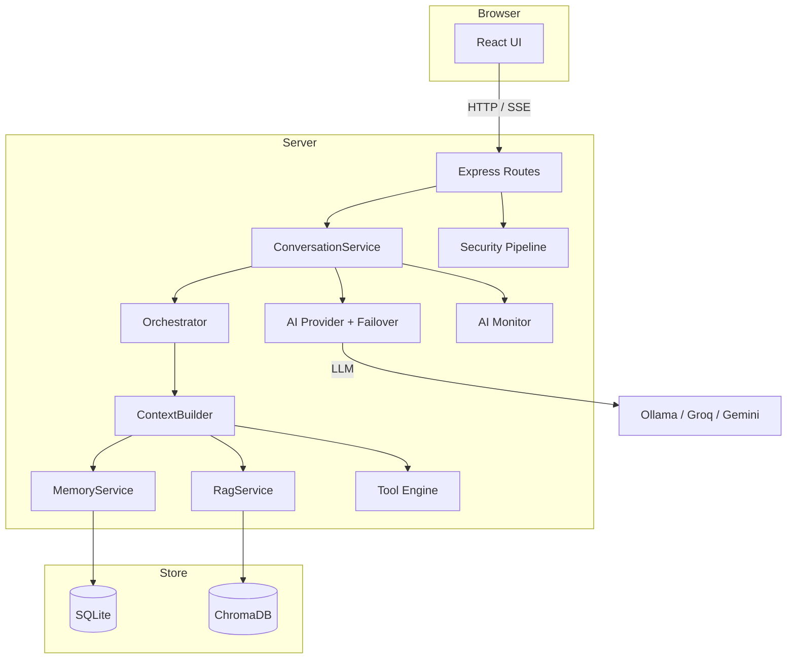
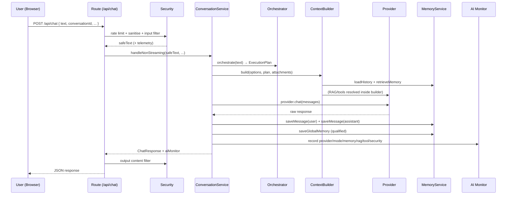
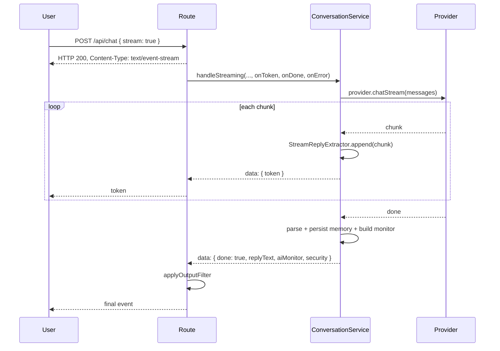

# System Architecture

This document describes the high-level architecture of **Noryx**. It explains *why* each component exists and how they fit together. It is the entry point for understanding the system; deeper detail lives in the linked sub-documents.

- AI pipeline: [../AI/AI_ARCHITECTURE.md](../AI/AI_ARCHITECTURE.md)
- Backend internals: [../Backend/BACKEND.md](../Backend/BACKEND.md)
- Frontend internals: [../Frontend/FRONTEND.md](../Frontend/FRONTEND.md)
- Security: [../Security/SECURITY.md](../Security/SECURITY.md)
- Data flow diagrams: [../DataFlow/DATA_FLOW.md](../DataFlow/DATA_FLOW.md)

---

## 1. High-level architecture

Noryx is a monolithic full-stack TypeScript application:

- **Frontend** — React 19 + Vite, served by the same Express process in production (or by the Vite dev middleware in development).
- **Backend** — Express.js server (`server.ts`) exposing a JSON + SSE API.
- **AI core** — a layered pipeline (orchestrator → context builder → provider) that turns a user message into a model response.
- **Persistence** — SQLite (via Better-SQLite3) for conversations, messages, and global memory; ChromaDB for document embeddings.
- **Security** — a centralised `server/security/` module applied at the route boundary.

---

## 2. Component responsibilities

| Component | Location | Responsibility | Why it exists |
|-----------|----------|----------------|---------------|
| **Express app** | `server.ts` | Wires middleware, routes, startup checks, and (dev/prod) frontend serving. | Single process entry point; keeps bootstrap logic in one place. |
| **Routes** | `server/routes/*` | Thin HTTP controllers: validate input, call services, shape responses. | Keeps HTTP concerns (status codes, streaming) out of business logic. |
| **ConversationService** | `server/ai/conversation/` | Orchestrates a single chat turn: orchestrate → build context → call provider → persist → monitor. | The "use case" layer that coordinates the AI subsystems. |
| **Orchestrator** | `server/ai/orchestrator/` | Deterministic rule engine producing an `ExecutionPlan` (use memory? RAG? tools?). | Avoids LLM calls for routing; makes behaviour predictable and cheap. |
| **ContextBuilder** | `server/ai/context/` | Assembles the full `OllamaMessage[]` prompt from system prompt, history, memory, RAG, tools, and user message, then applies a token budget. | Single, testable place where the prompt is composed. |
| **Provider layer** | `server/ai/provider.ts`, `ollama.ts`, `groq.ts`, `gemini.ts`, `failover.ts` | Uniform `AIProvider` interface with optional failover across providers. | Swappable models; resilience via failover. |
| **MemoryService** | `server/memory/` | Conversation CRUD + global (site-wide) Q&A memory. | Persists chat history and reuses past answers across conversations. |
| **RagService** | `server/ai/rag/` | Attachment-scoped semantic retrieval over indexed documents. | Lets users "talk to their documents" without leaking unrelated content. |
| **Tool Engine** | `server/ai/tools/` | Registry + deterministic planner + executor for calculator / datetime tools. | Extends the assistant with deterministic capabilities. |
| **AI Monitor** | `server/ai/monitor/` | Request-scoped telemetry collector (provider, latency, mode, memory/RAG/tool/security). | Surfaces what happened during a request to the frontend. |
| **Security** | `server/security/` | Input sanitisation, content filtering, prompt-injection detection, file validation, rate limiting, secret audit, telemetry. | Centralised, reusable, testable safety net. |
| **Config** | `server/config/` | Typed, validated environment configuration singleton. | No scattered `process.env` reads; fail fast on bad config. |
| **Database** | `server/db/` | SQLite singleton + migration runner. | Versioned schema; single connection. |

---

## 3. Request lifecycle (non-streaming)

Key points:
- Security runs **before** business logic (input) and **after** the model (output).
- The Orchestrator decides *which* context sources to activate; the ContextBuilder *assembles* them.
- Memory is persisted for both the conversation and the global memory store.
- The AI Monitor is built from the request lifecycle and returned alongside the response.

---

## 4. Streaming lifecycle

When `stream: true`, the route opens a Server-Sent Events (SSE) connection. Tokens are streamed as they arrive; a final `done` event carries the complete response plus AI Monitor data.

The frontend (`sendChatMessageStream` in `src/lib/api.ts`) reads the stream, calls `onToken` for each delta, and resolves with the final `ChatResponseDTO`. After the stream completes, the frontend reloads the conversation from the backend (source of truth).

---

## 5. AI pipeline

See [../AI/AI_ARCHITECTURE.md](../AI/AI_ARCHITECTURE.md) for the full breakdown. In summary:

1. **Orchestrator** — `PolicyEngine` evaluates ordered rules; `Planner` refines with runtime context (e.g. resolves a specific tool). Result: `ExecutionPlan`.
2. **ContextBuilder** — assembles sections in a fixed order, each with a priority, then applies a `TokenBudgeter`.
3. **Provider** — `getAIProvider()` returns a failover-aware `AIProvider`; `chat()` / `chatStream()` produce the response.
4. **Memory** — global memory is retrieved *before* inference and persisted *after* (if qualified).
5. **RAG** — only when documents are attached to the message or conversation; retrieval is scoped to those document IDs.
6. **Tools** — deterministic planner matches calculator / datetime; results are injected as a system section.
7. **AI Monitor** — collects metadata across the lifecycle.

---

## 6. Conversation lifecycle

- A conversation is created lazily by the frontend (`useChatManager`) or explicitly via `POST /api/conversations`.
- Messages are persisted by `MemoryService.saveMessage` after each assistant turn.
- The first user+assistant exchange triggers automatic title generation (`titleGenerator`), unless the conversation was manually renamed (`titleGenerated = 0`).
- Deleting a conversation removes its messages and purges its active-document references.

---

## 7. Workspace Intelligence

The **Workspace Intelligence** sidebar (`src/components/WorkspaceIntelligenceSidebar.tsx`) is the system's observability surface. It:

- Polls `GET /api/system/health` every 45s for tri-state component health (backend, providers, database, chromadb, embeddings, memory, rag).
- Displays the latest `AIMonitorDTO` (provider, latency, mode, memory/RAG/tool metrics, security).
- Auto-expands on key events dispatched by the frontend (`memory-retrieved`, `rag-retrieval`, `tool-executed`, `document-uploaded`, `system-degraded`) with a 5-minute per-category cooldown.

It is a **read-only** view — it never mutates state.

---

## 8. AI Monitor

The AI Monitor (`server/ai/monitor/`) is a **request-scoped** metadata collector, not an observability platform. Each chat request creates a collector via `createAIMonitor(provider, model)`. Subsystems call `recordMemory`, `recordRag`, `recordTool`, `recordSecurity`, and `setMode`. At the end of the request, `getData()` returns an `AIMonitorData` object that is serialised into the response (`aiMonitor` field) and rendered by `AIMonitorPanel.tsx`.

It deliberately stores **no sensitive user content** — only counters, labels, provider/model names, latency, and confidence scores.

---

## 9. Security layer

All security logic is centralised in `server/security/` and exposed through a single barrel (`server/security/index.ts`). Every `/api/chat` and `/api/rag/*` request passes through:

1. **Rate limiting** (per client IP).
2. **Input sanitisation** (control-char stripping, length limits).
3. **Input content filtering** (category-based allow/warn/redact/block).
4. **Prompt-injection detection** (RAG queries and document text).
5. **File validation** (upload MIME/ext/size/duplicate checks).
6. **Output content filtering** (post-LLM, before the response leaves the server).
7. **Security telemetry** (attached to the response, never containing user content).

See [../Security/SECURITY.md](../Security/SECURITY.md) for the full threat model and trust boundaries.

---

## 10. Knowledge Center

The **Knowledge Center** (`src/components/KnowledgeCenter.tsx`) is the document management UI. It is backed by `useDocumentManager`, which talks to `/api/rag/*`. Documents are:

- Uploaded (validated + scanned for injection) → split into chunks → embedded → stored in ChromaDB.
- Listed, previewed, summarised (AI insights), reindexed, and deleted.
- "Attached" to a conversation so the assistant can scope RAG retrieval to them.

Crucially, **Knowledge Center documents never participate in chat retrieval unless explicitly attached** to the current conversation. This prevents unrelated document content from leaking into responses. See [../DataFlow/DATA_FLOW.md](../DataFlow/DATA_FLOW.md) for the retrieval diagram.

---

## 11. Why this shape?

- **Deterministic orchestration** keeps routing cheap and predictable (no LLM call to decide routing).
- **Thin routes + service layer** makes the system testable and lets security be applied uniformly.
- **Attachment-scoped RAG** enforces a clear trust boundary: only user-attached documents influence a given conversation.
- **Request-scoped monitoring** gives full per-request visibility without a heavy observability stack.
- **Backend as source of truth** simplifies the frontend and avoids client/server state drift.