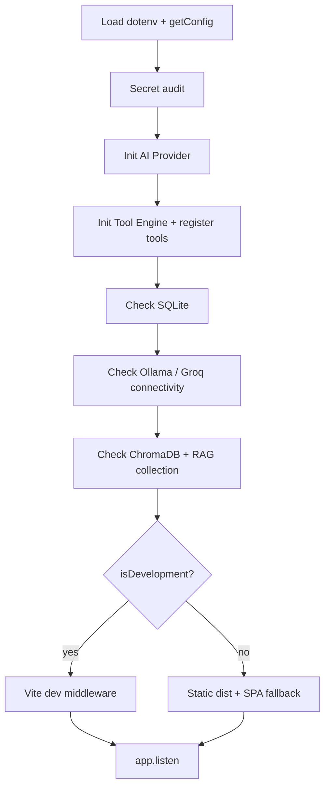
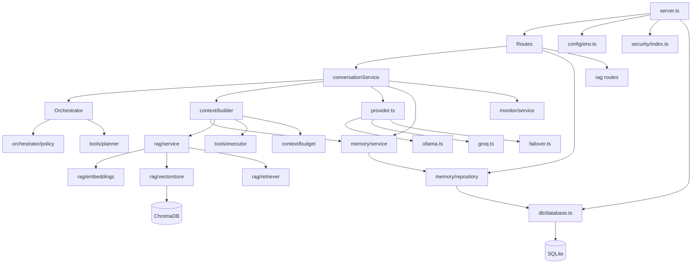

# Backend Documentation

This document describes the server-side structure of **Noryx**: folder layout, services, routes, middleware, repositories, utilities, configuration, startup process, and the dependency graph.

- System overview: [../Architecture/SYSTEM_ARCHITECTURE.md](../Architecture/SYSTEM_ARCHITECTURE.md)
- AI internals: [../AI/AI_ARCHITECTURE.md](../AI/AI_ARCHITECTURE.md)
- API reference: [../Reference/API.md](../Reference/API.md)

---

## 1. Folder structure

```
server/
├── config/            Typed, validated environment config (env.ts, version.ts)
├── ai/                AI logic
│   ├── config.ts          Model registry + active model resolution
│   ├── types.ts           Server-only AI types (re-exports shared types)
│   ├── prompts.ts         System prompt builders
│   ├── parser.ts          Robust JSON extraction + StreamReplyExtractor
│   ├── provider.ts        Provider factory + failover selection
│   ├── ollama.ts          Ollama provider
│   ├── groq.ts            Groq provider
│   ├── gemini.ts          Gemini provider (failover target)
│   ├── failover.ts        Multi-provider failover wrapper
│   ├── summarize.ts       Conversation title summariser
│   ├── orchestrator/      Deterministic routing (policy, planner, types)
│   ├── context/           Prompt assembly (builder, formatter, budget, types)
│   ├── conversation/      ConversationService (use-case orchestration)
│   ├── rag/               Retrieval pipeline (embeddings, vectorstore, retriever, splitter, loader)
│   ├── tools/             Tool engine (registry, planner, executor, calculator, datetime)
│   └── monitor/           Request-scoped AI telemetry (service, types)
├── memory/            Conversation + global memory (service, repository, retrieval, qualifier, types)
├── routes/            Express controllers (chat, conversations, health, rag, summarize, tts)
├── middleware/        Global error handling (error.ts)
├── security/          Centralised security services (see Security/SECURITY.md)
├── services/          Cross-cutting services (health.ts)
├── db/                SQLite singleton + migration runner + SQL migrations
├── utils/             logger, errors, retry, validation
└── tsconfig.json
```

`shared/types.ts` holds API contracts and domain models shared by frontend and backend.

---

## 2. Services

| Service | File | Responsibility |
|---------|------|----------------|
| **ConversationService** | `ai/conversation/conversationService.ts` | Coordinates a chat turn: orchestrate → build context → provider → persist → monitor. Exposes `handleNonStreaming` and `handleStreaming`. |
| **MemoryService** | `memory/service.ts` | Conversation CRUD + global memory. Singleton `memoryService`. |
| **RagService** | `ai/rag/service.ts` | Lazy-init RAG pipeline; `retrieveContext` / `retrieveContextForDocuments`; `isAvailable`, `reset`. Singleton `ragService`. |
| **ToolRegistry** | `ai/tools/registry.ts` | Singleton registry of available tools. |
| **HealthService** | `services/health.ts` | `getHealth()` and `getSystemHealth()` tri-state reports. |
| **AI Monitor** | `ai/monitor/service.ts` | `createAIMonitor()` request-scoped collector. |

---

## 3. Routes

All routes are thin controllers. They validate input, delegate to services, and shape responses.

| Route file | Mount | Endpoints |
|------------|-------|-----------|
| `routes/chat.ts` | `POST /api/chat` | Chat (streaming + non-streaming) with full security pipeline. |
| `routes/conversations.ts` | `/api/conversations` | CRUD for conversations + messages. |
| `routes/rag.ts` | `/api/rag/*` | Document upload, search, list, get, delete, reindex, stats, summarise, active-doc management. |
| `routes/health.ts` | `/health`, `/ready`, `/version`, `/api/health`, `/api/system/health` | Liveness, readiness, version, health reports. |
| `routes/summarize.ts` | `POST /api/summarize` | Generate a conversation title. |
| `routes/tts.ts` | `POST /api/tts` | TTS fallback marker. |

Route mounting order in `server.ts`:

```ts
app.use("/", healthRouter);            // /health, /ready, /version, /api/health, /api/system/health
app.post("/api/chat", handleChat);
app.post("/api/summarize", handleSummarize);
app.post("/api/tts", handleTTS);
app.use("/", conversationsRouter);     // /api/conversations*
app.use("/api", ragRouter);            // /api/rag/*
app.use("/api", apiNotFoundHandler);   // 404 for unknown /api/*
app.use(globalErrorHandler);           // last
```

---

## 4. Middleware

**File:** `server/middleware/error.ts`

- `apiNotFoundHandler` — returns `404 NOT_FOUND` for unknown `/api/*` routes. Mounted after all API routes, before the SPA catch-all.
- `globalErrorHandler` — four-argument Express handler. `AppError` subclasses render their own `statusCode`/`code`; everything else renders `500 INTERNAL_ERROR` (message hidden in production).

Global middleware applied in `server.ts`:
- `express.json({ limit: SEC_JSON_BODY_LIMIT })` (default `10mb`).
- Request timeout (`SEC_REQUEST_TIMEOUT_MS`, default `120000` → `408`).

---

## 5. Repositories

**File:** `server/memory/repository.ts`

The repository layer wraps raw Better-SQLite3 statements. `MemoryService` is the only consumer; routes never touch the repository directly. It manages:

- Conversations (`conversations` table): create, get, list, rename, set title, delete.
- Messages (`messages` table): save, get.
- Active documents (`conversations.active_documents`): set, remove, purge from all conversations.
- Global memory (`global_memory` table): save, get all, search (scored), delete.

Documents metadata lives in the `documents` table, accessed directly by `routes/rag.ts` (not via the memory repository).

---

## 6. Utilities

| Utility | File | Responsibility |
|---------|------|----------------|
| **Logger** | `utils/logger.ts` | Structured logger (DEBUG dev-only, INFO, WARN, ERROR). |
| **Errors** | `utils/errors.ts` | `AppError` hierarchy: `ValidationError`, `OllamaError`, `ParseError`, `ConfigError`, `RetryExhaustedError`, `NotFoundError`. |
| **Retry** | `utils/retry.ts` | `withRetry()` exponential backoff for connection errors. |
| **Validation** | `utils/validation.ts` | `validateChatRequest`, `validateSummaryRequest`, `validateTtsRequest`, `assertString`. |

---

## 7. Configuration

**File:** `server/config/env.ts`

`getConfig()` returns a cached, typed `AppConfig`. Required variables are validated eagerly. Key fields:

- `server` — port, nodeEnv, isProduction/isDevelopment.
- `aiProvider` — `"ollama" | "groq"`.
- `ollama` — baseUrl, modelName.
- `groq` — apiKey, modelName.
- `gemini` — apiKey, modelName (used by failover).
- `vite` — hmrPort, disableHmr.

No module reads `process.env` directly except this one (plus a few targeted security overrides). See [../Developer/DEVELOPER_GUIDE.md](../Developer/DEVELOPER_GUIDE.md) for the full env-var list.

---

## 8. Startup process

`server.ts → start()`:



- `SecretAuditService.audit()` runs at startup; missing required secrets produce a warning (not a hard failure).
- Dependency checks are best-effort (`checkDependency` logs ✗ but continues) so the server still boots when optional services (ChromaDB) are down.
- On `ConfigError`, a helpful message is printed and the process exits `1`.

---

## 9. Dependency graph



Dependency direction is strictly **routes → services → repositories/utils**. No service imports a route; no route imports another route's internals. Security is a leaf dependency imported by routes.