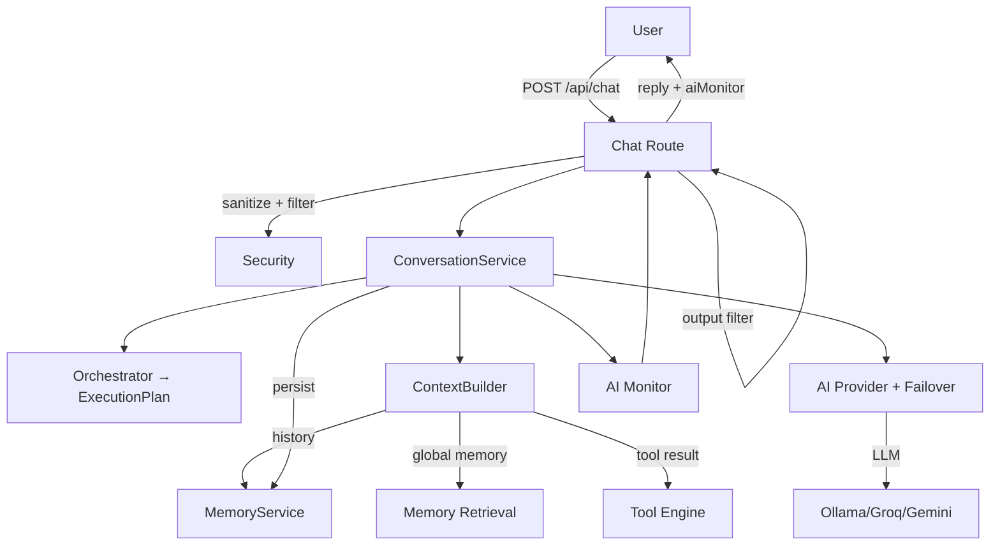
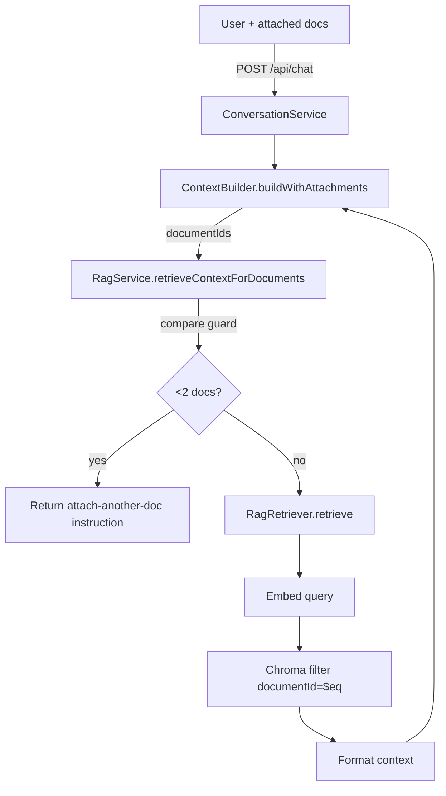
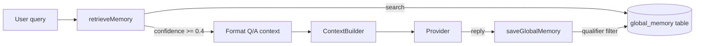
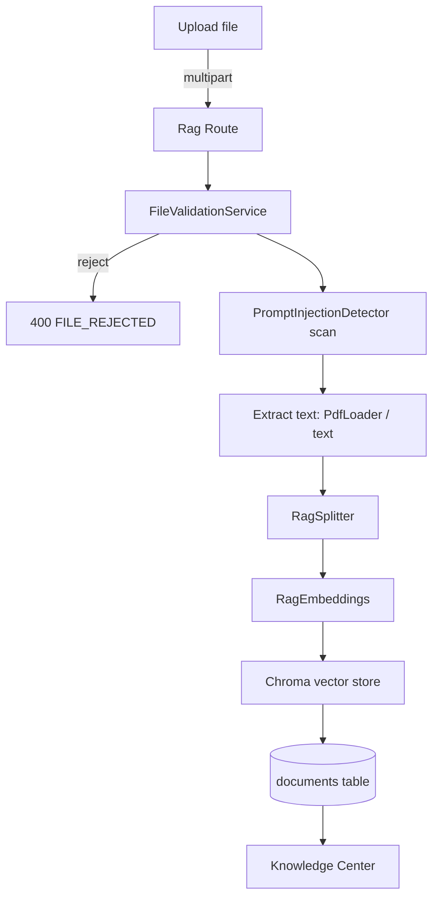
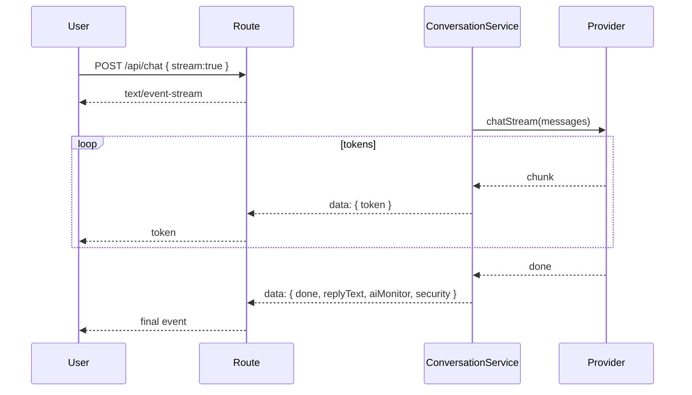
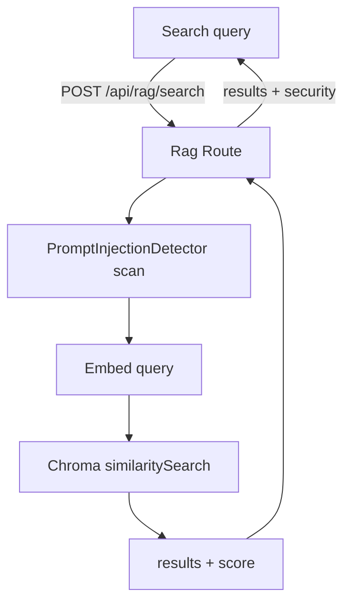

# Data Flow Diagrams

Mermaid diagrams for the key data flows in **Noryx**. These complement the prose in [../AI/AI_ARCHITECTURE.md](../AI/AI_ARCHITECTURE.md) and [../Architecture/SYSTEM_ARCHITECTURE.md](../Architecture/SYSTEM_ARCHITECTURE.md).

---

## 1. User → AI (chat turn)



---

## 2. User → RAG (attachment-scoped retrieval)



---

## 3. User → Memory (global memory)



---

## 4. Document Upload (ingestion)



---

## 5. Streaming



---

## 6. Voice

```mermaid
flowchart LR
    Sp[Speech] --> SR[Web Speech Recognition]
    SR -->|transcript| U[sendMessageToBot isVoice=true]
    U -->|POST /api/chat| BE[Backend]
    BE -->|isVoice hint (request-scoped)| Ctx[ContextBuilder]
    Ctx --> P[Provider]
    P -->|replyText| BE
    BE -->|stream| U
    U -->|SpeechSynthesis| Out[Audio playback]
```

---

## 7. Knowledge Retrieval (search endpoint)



---

## 8. Security Pipeline

```mermaid
flowchart TB
    Req[Request] --> RL[Rate Limiter]
    RL -->|429| Rej[Reject]
    RL --> IN[InputSecurityService.sanitize]
    IN -->|block| Rej
    IN --> CF1[ContentFilterService input]
    CF1 -->|block| Rej
    CF1 --> Biz[Business logic]
    Biz --> CF2[ContentFilterService output]
    CF2 --> Tel[SecurityTelemetry]
    Tel --> Resp[Response + security]