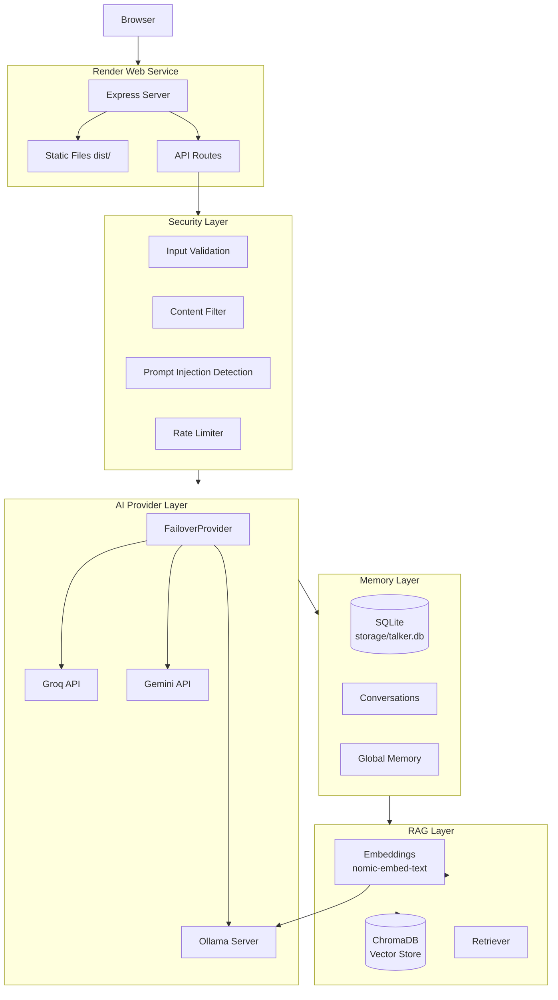

# Render Deployment Guide — Noryx

> **Version:** 1.0.0  
> **Applies to:** Noryx AI Workspace  
> **Platform:** Render (Web Service)  
> **Last updated:** 2026-07-18

---

## Table of Contents

1. [Overview](#1-overview)
2. [Prerequisites](#2-prerequisites)
3. [Production Architecture](#3-production-architecture)
4. [Environment Variables](#4-environment-variables)
5. [Render Configuration](#5-render-configuration)
6. [Deployment Steps](#6-deployment-steps)
7. [Post-Deployment Verification](#7-post-deployment-verification)
8. [Troubleshooting](#8-troubleshooting)
9. [Updating Production](#9-updating-production)
10. [Cost Considerations](#10-cost-considerations)
11. [Future Improvements](#11-future-improvements)

---

## 1. Overview

### What is Noryx?

Noryx is a full-stack conversational AI workspace with memory, retrieval-augmented generation (RAG), and intelligent tooling. It provides a chat interface backed by multiple AI providers (Groq, Gemini, Ollama) with automatic failover, document upload and semantic search, conversation management, and a security-hardened API layer.

### Render Services Required

Noryx deploys as a single **Render Web Service**. No additional Render services (databases, Redis, etc.) are required because:

- **SQLite** is used for persistence (file-based, stored in the Render disk).
- **ChromaDB** is an external dependency (not hosted on Render).
- **AI providers** (Groq, Gemini, Ollama) are external API services.

### Deployment Architecture

```
┌─────────────────────────────────────────────────────────┐
│                    Render Web Service                    │
│                                                          │
│  ┌──────────────┐    ┌──────────────────────────────┐   │
│  │   Frontend    │    │         Backend               │   │
│  │  (Vite/React) │    │     (Express Server)          │   │
│  │   dist/       │◄──►│                              │   │
│  │               │    │  /api/chat                   │   │
│  │  SPA served   │    │  /api/conversations          │   │
│  │  by Express   │    │  /api/rag/*                  │   │
│  │               │    │  /api/summarize              │   │
│  │               │    │  /api/tts                    │   │
│  │               │    │  /health, /ready, /version   │   │
│  └──────────────┘    └───────────┬───────────────────┘   │
│                                  │                        │
└──────────────────────────────────┼────────────────────────┘
                                   │
                    ┌──────────────┼──────────────┐
                    ▼              ▼              ▼
              ┌──────────┐  ┌──────────┐  ┌──────────┐
              │  Groq    │  │  Gemini  │  │  Ollama  │
              │  API     │  │  API     │  │  (local) │
              └──────────┘  └──────────┘  └──────────┘
                                   │
                    ┌──────────────┼──────────────┐
                    ▼              ▼              ▼
              ┌──────────┐  ┌──────────┐  ┌──────────┐
              │ ChromaDB │  │  SQLite  │  │ Firebase │
              │(Vector   │  │(Storage  │  │(Auth -   │
              │ Store)   │  │  Disk)   │  │ Frontend)│
              └──────────┘  └──────────┘  └──────────┘
```

### Frontend + Backend Layout

- **Frontend:** React SPA built with Vite, served by Express in production from the `dist/` directory.
- **Backend:** Express server bundled into a single `dist/server.cjs` file via esbuild.
- **Single port:** Both frontend and backend run on the same port (`PORT`, default `3000`).
- **SPA routing:** A catch-all `app.get("*")` route returns `dist/index.html` for client-side routing.

### External Services Used

| Service | Purpose | Required? | Hosted On |
|---------|---------|-----------|-----------|
| Groq API | Primary AI provider (chat, streaming, summarization) | Yes (recommended) | api.groq.com |
| Gemini API | Failover AI provider | Optional | Google AI |
| Ollama | Local AI provider (not practical on Render) | Optional | External server |
| ChromaDB | Vector store for RAG / Knowledge Center | Optional | External server |
| SQLite | Persistent storage (conversations, memory, documents) | Yes | Render disk |
| Firebase | Frontend authentication | Optional | Firebase console |

---

## 2. Prerequisites

### GitHub Repository

- A GitHub repository containing the Noryx codebase.
- Render will connect to this repository for automatic deployments.

### Render Account

- A [Render](https://render.com) account (free tier available).
- Sufficient credits or a paid plan for production workloads.

### Required APIs

| API | How to Obtain | Cost |
|-----|---------------|------|
| **Groq API Key** | [Groq Console](https://console.groq.com/keys) | Free tier available (30 req/min on free) |
| **Firebase Project** | [Firebase Console](https://console.firebase.google.com) | Free tier (Spark plan) |

### Optional Services

| Service | When Needed | Notes |
|---------|-------------|-------|
| **Ollama** | If using `AI_PROVIDER=ollama` | Requires a separate server with Ollama installed. Not practical on Render free tier. Use Groq instead. |
| **Groq** | Primary cloud provider | Recommended for production. Set `AI_PROVIDER=groq`. |
| **Gemini** | Failover provider | Set `GEMINI_API_KEY` and enable failover. |
| **ChromaDB** | RAG / Knowledge Center | Requires a ChromaDB server reachable from Render. Can be self-hosted or use a cloud Chroma provider. |
| **SQLite** | Always required | File-based, stored on Render's ephemeral disk or persistent disk. |

> **Important:** For production on Render, use `AI_PROVIDER=groq` with a Groq API key. Ollama requires a running Ollama server which cannot run on Render's free tier.

---

## 3. Production Architecture

### Request Flow

```
Browser
  │
  ▼
Render Web Service (Port: ${PORT})
  │
  ├── Express Static Middleware (serves dist/ for SPA)
  │
  └── Express API Routes
        │
        ├── POST /api/chat ──────────────────────────────────┐
        │                                                    │
        ▼                                                    ▼
  AI Provider Layer (FailoverProvider)              Security Layer
  │                                                    │
  ├── Primary: Groq API (cloud)                       ├── Input validation
  ├── Failover 1: Gemini API (cloud)                  ├── Content filtering
  └── Failover 2: Ollama (external)                   ├── Prompt injection detection
                                                      ├── Rate limiting
                                                      └── File validation
  │
  ▼
  Memory Layer (SQLite)
  │
  ├── Conversation history
  ├── Global memory (key-value)
  └── Title generation
  │
  ▼
  RAG Layer (if documents attached)
  │
  ├── Embedding generation (Ollama: nomic-embed-text)
  ├── Vector search (ChromaDB)
  └── Context injection
  │
  ▼
  SQLite Database (storage/talker.db)
```

### Mermaid Diagram



---

## 4. Environment Variables

### Complete Environment Variable Table

| Variable | Purpose | Required? | Example | Default |
|----------|---------|-----------|---------|---------|
| `NODE_ENV` | Runtime environment | **Yes** | `production` | `development` |
| `PORT` | Server listen port | No | `3000` | `3000` |
| `AI_PROVIDER` | Primary AI provider | **Yes** | `groq` | `ollama` |
| `GROQ_API_KEY` | Groq API authentication | **Yes** (if using Groq) | `gsk_your_key_here` | — |
| `GROQ_MODEL` | Groq model name | No | `llama-3.3-70b-versatile` | `llama-3.3-70b-versatile` |
| `GEMINI_API_KEY` | Gemini API authentication | No | `AIza_your_key_here` | — |
| `GEMINI_MODEL` | Gemini model name | No | `gemini-2.0-flash-exp` | `gemini-2.0-flash-exp` |
| `OLLAMA_URL` | Ollama server URL | No | `http://192.168.1.100:11434` | `http://127.0.0.1:11434` |
| `OLLAMA_MODEL` | Ollama model name | No | `llama3.2:3b` | `llama3.2:3b` |
| `AI_FAILOVER_ENABLED` | Enable automatic provider failover | No | `true` | `true` |
| `AI_PROVIDER_PRIORITY` | Failover priority order | No | `groq,gemini,ollama` | `groq,gemini,ollama` |
| `CHROMA_HOST` | ChromaDB server host | No | `192.168.1.100` | `localhost` |
| `CHROMA_PORT` | ChromaDB server port | No | `8000` | `8000` |
| `VITE_FIREBASE_API_KEY` | Firebase API key (frontend) | No | `AIzaSy...` | — |
| `VITE_FIREBASE_AUTH_DOMAIN` | Firebase auth domain | No | `your-project.firebaseapp.com` | — |
| `VITE_FIREBASE_PROJECT_ID` | Firebase project ID | No | `your-project-id` | — |
| `VITE_FIREBASE_STORAGE_BUCKET` | Firebase storage bucket | No | `your-project.appspot.com` | — |
| `VITE_FIREBASE_MESSAGING_SENDER_ID` | Firebase sender ID | No | `123456789012` | — |
| `VITE_FIREBASE_APP_ID` | Firebase app ID | No | `1:123456789012:web:abc123` | — |
| `VITE_FIREBASE_MEASUREMENT_ID` | Firebase measurement ID | No | `G-XXXXXXXXXX` | — |
| `VITE_FIREBASE_FIRESTORE_DATABASE_ID` | Firestore database ID | No | `(default)` | — |
| `SEC_JSON_BODY_LIMIT` | Max JSON request body size | No | `10mb` | `10mb` |
| `SEC_REQUEST_TIMEOUT_MS` | Request timeout in milliseconds | No | `120000` | `120000` |
| `SEC_MAX_INPUT_LENGTH` | Max chat message characters | No | `8000` | `8000` |
| `SEC_MAX_QUERY_LENGTH` | Max RAG query characters | No | `2000` | `2000` |
| `SEC_TOKEN_FLOOD_RATIO` | Token flood detection ratio (0-1) | No | `0.6` | `0.6` |
| `SEC_TOKEN_FLOOD_MIN_TOKENS` | Min tokens for flood check | No | `20` | `20` |
| `SEC_BLOCK_SEVERITY` | Content block severity threshold (0-100) | No | `80` | `80` |
| `SEC_REDACT_SEVERITY` | Content redact severity threshold (0-100) | No | `55` | `55` |
| `SEC_WARN_SEVERITY` | Content warn severity threshold (0-100) | No | `30` | `30` |
| `SEC_ENABLE_OUTPUT_FILTER` | Enable post-LLM output filter | No | `true` | `true` |
| `SEC_ENABLE_INPUT_FILTER` | Enable pre-LLM input filter | No | `true` | `true` |
| `SEC_INJECTION_FLAG_SCORE` | Prompt injection flag threshold (0-100) | No | `40` | `40` |
| `SEC_STRIP_INJECTION` | Strip detected injection instructions | No | `true` | `true` |
| `RAG_MAX_UPLOAD_SIZE_MB` | Max document upload size in MB | No | `10` | `10` |
| `SEC_REJECT_DUPLICATES` | Reject duplicate file uploads | No | `true` | `true` |
| `SEC_RATE_LIMIT_MAX` | Max requests per rate limit window | No | `60` | `60` |
| `SEC_RATE_LIMIT_WINDOW_SEC` | Rate limit window in seconds | No | `60` | `60` |
| `SEC_ENABLE_RATE_LIMIT` | Enable rate limiting middleware | No | `true` | `true` |
| `SEC_ENABLE_TELEMETRY` | Enable security telemetry | No | `true` | `true` |

### Minimum Required Variables for Production

```bash
NODE_ENV=production
AI_PROVIDER=groq
GROQ_API_KEY=gsk_your_key_here
```

### Recommended Variables for Full Functionality

```bash
NODE_ENV=production
PORT=3000
AI_PROVIDER=groq
GROQ_API_KEY=gsk_your_key_here
GROQ_MODEL=llama-3.3-70b-versatile
GEMINI_API_KEY=AIza_your_key_here
GEMINI_MODEL=gemini-2.0-flash-exp
AI_FAILOVER_ENABLED=true
AI_PROVIDER_PRIORITY=groq,gemini,ollama
CHROMA_HOST=your-chroma-server.com
CHROMA_PORT=8000
SEC_RATE_LIMIT_MAX=120
SEC_RATE_LIMIT_WINDOW_SEC=60
```

---

## 5. Render Configuration

### Web Service Settings

| Setting | Value | Notes |
|---------|-------|-------|
| **Runtime** | `Node` | Render detects Node.js from package.json |
| **Build Command** | `npm install && npm run build` | Installs deps, builds frontend + backend |
| **Start Command** | `npm start` | Runs `node dist/server.cjs` |
| **Node Version** | `18` or `20` | Use the latest LTS (Render defaults to 18) |
| **Health Check Path** | `/health` | Liveness probe — returns 200 when alive |
| **Root Directory** | (leave empty) | The project root contains package.json |
| **Auto-Deploy** | `Yes` | Deploys on every push to the selected branch |
| **Branch** | `main` (or your production branch) | — |

### Instance Type Recommendations

| Use Case | Plan | RAM | CPU | Disk | Cost |
|----------|------|-----|-----|------|------|
| Development / Testing | Free | 512 MB | Shared | 1 GB (ephemeral) | Free |
| Low-traffic production | Starter ($7/mo) | 512 MB | Shared | 1 GB (ephemeral) | $7/mo |
| Production (recommended) | Professional ($20/mo) | 1 GB | 0.5 CPU | 10 GB (persistent) | $20/mo |
| High-traffic production | Professional + ($40/mo) | 2 GB | 1 CPU | 20 GB (persistent) | $40/mo |

> **Important:** The Free tier has an ephemeral disk. SQLite data will be **lost** on every restart. For production, use at minimum the **Starter** plan, and preferably the **Professional** plan for persistent disk storage.

### Persistent Disk

- Render Web Services support **persistent disk** on paid plans (Starter and above).
- Mount path: `/opt/render/project/src/storage` (or the project root).
- Noryx stores SQLite at `storage/talker.db` relative to the project root.
- On Render, the project root is `/opt/render/project/src`.
- The `storage/` directory will be at `/opt/render/project/src/storage/talker.db`.

> **Note:** Render's persistent disk is available on paid plans. Without it, SQLite data is ephemeral and will be lost on service restarts.

---

## 6. Deployment Steps

### Step 1: Prepare Your Repository

Ensure your GitHub repository has the latest code committed:

```bash
git add .
git commit -m "Ready for production deployment"
git push origin main
```

### Step 2: Create a Render Web Service

1. Log in to [Render Dashboard](https://dashboard.render.com).
2. Click **New +** → **Web Service**.
3. Connect your GitHub account and select the Noryx repository.
4. Configure the service:

   | Field | Value |
   |-------|-------|
   | **Name** | `noryx` (or your preferred name) |
   | **Region** | Choose the closest to your users |
   | **Branch** | `main` |
   | **Runtime** | `Node` |
   | **Build Command** | `npm install && npm run build` |
   | **Start Command** | `npm start` |
   | **Plan** | Select based on your needs (see [Instance Type Recommendations](#instance-type-recommendations)) |

### Step 3: Configure Environment Variables

1. Scroll down to the **Environment Variables** section.
2. Add the following **minimum required** variables:

   ```
   NODE_ENV=production
   AI_PROVIDER=groq
   GROQ_API_KEY=gsk_your_key_here
   ```

3. Add **recommended** variables:

   ```
   PORT=3000
   GROQ_MODEL=llama-3.3-70b-versatile
   GEMINI_API_KEY=AIza_your_key_here
   GEMINI_MODEL=gemini-2.0-flash-exp
   AI_FAILOVER_ENABLED=true
   AI_PROVIDER_PRIORITY=groq,gemini,ollama
   ```

4. Add **optional** variables as needed (see [Environment Variables table](#4-environment-variables)).

### Step 4: Configure Health Check

1. In the **Health Check** section, set:
   - **Health Check Path:** `/health`
   - **Health Check Timeout:** `10` seconds (default)

### Step 5: Configure Persistent Disk (Paid Plans Only)

1. In the **Disks** section, click **Add Disk**.
2. Configure:
   - **Name:** `noryx-data`
   - **Mount Path:** `/opt/render/project/src/storage`
   - **Size:** At least 1 GB (recommended: 10 GB)

> This ensures SQLite data persists across deployments and restarts.

### Step 6: Deploy

1. Click **Create Web Service**.
2. Render will:
   - Pull the repository
   - Run `npm install`
   - Run `npm run build`
   - Start the server with `npm start`
3. Monitor the **Logs** tab for build and startup output.

### Step 7: Verify Deployment

1. Once the service shows as **Live**, navigate to `https://your-service.onrender.com`.
2. Check the health endpoint: `https://your-service.onrender.com/health`
3. Check the version endpoint: `https://your-service.onrender.com/version`
4. Verify the frontend loads at the root URL.

### Screenshot Placeholders

> **Screenshot 1:** Render Dashboard — Create Web Service form  
> *[Insert screenshot of the Render "New Web Service" form with fields filled in]*

> **Screenshot 2:** Render Dashboard — Environment Variables section  
> *[Insert screenshot showing environment variables configured]*

> **Screenshot 3:** Render Dashboard — Deploy logs showing successful build  
> *[Insert screenshot of successful build output]*

> **Screenshot 4:** Browser — Noryx homepage loading successfully  
> *[Insert screenshot of the Noryx frontend]*

---

## 7. Post-Deployment Verification

### Verification Checklist

Use this checklist to verify the deployment is fully functional:

- [ ] **Homepage loads** — Navigate to `https://your-service.onrender.com` and confirm the Noryx UI renders.
- [ ] **Health endpoint** — `GET /health` returns `{ "status": "ok", "model": "...", "timestamp": "..." }`.
- [ ] **Readiness endpoint** — `GET /ready` returns `{ "status": "ready", "uptime": ... }`.
- [ ] **Version endpoint** — `GET /version` returns `{ "name": "noryx-ai-workspace", "version": "1.0.0", ... }`.
- [ ] **Chat works** — Send a chat message via the UI and confirm a response is received.
- [ ] **Streaming works** — Confirm responses stream token-by-token (not a single delayed response).
- [ ] **AI Monitor works** — Open the AI Monitor panel and confirm it shows provider, model, latency, and mode.
- [ ] **Uploads work** — Upload a PDF document and confirm it is indexed.
- [ ] **RAG works** — Ask a question about the uploaded document and confirm context-aware responses.
- [ ] **Authentication works** — If Firebase is configured, confirm login/logout flow works.
- [ ] **Conversations persist** — Create a conversation, refresh the page, and confirm it still exists.
- [ ] **Build logs clean** — Review the Render build logs for any warnings or errors.
- [ ] **No 404s** — Navigate to a non-existent route and confirm the SPA handles it (returns the app, not a 404).

### API Endpoint Verification

```bash
# Health check
curl https://your-service.onrender.com/health

# Readiness check
curl https://your-service.onrender.com/ready

# Version info
curl https://your-service.onrender.com/version

# System health (comprehensive)
curl https://your-service.onrender.com/api/health

# System Control Center health
curl https://your-service.onrender.com/api/system/health
```

Expected health response:

```json
{
  "status": "ok",
  "model": "llama-3.3-70b-versatile",
  "timestamp": "2026-07-18T14:30:00.000Z"
}
```

Expected version response:

```json
{
  "name": "noryx-ai-workspace",
  "version": "1.0.0",
  "node": "v18.20.0",
  "model": "llama-3.3-70b-versatile",
  "uptime": 123.456
}
```

---

## 8. Troubleshooting

### Build Failures

| Symptom | Likely Cause | Solution |
|---------|-------------|----------|
| `npm ERR!` during install | Network issue or dependency conflict | Check Render's status page. Try redeploying. |
| `esbuild` fails | Out of memory on free tier | Upgrade to a paid plan with more RAM. |
| `vite build` fails | TypeScript errors | Run `npm run lint` locally and fix errors. |
| `Cannot find module` | Missing dependency | Ensure `npm install` runs before `npm run build`. |
| Build succeeds but app crashes | Node version mismatch | Set Node version to 18 or 20 in Render settings. |

### Missing Environment Variables

| Symptom | Likely Cause | Solution |
|---------|-------------|----------|
| `ConfigError: Invalid AI_PROVIDER` | `AI_PROVIDER` not set or invalid | Set `AI_PROVIDER=groq` in environment variables. |
| `Groq API key not configured` | `GROQ_API_KEY` missing | Add `GROQ_API_KEY` to environment variables. |
| Server starts but chat returns errors | Missing API key for active provider | Verify the API key for the configured provider. |
| `Secret audit: missing GROQ_API_KEY` | Warning only, not fatal | Add the missing key or ignore if using a different provider. |

### Provider Failures

| Symptom | Likely Cause | Solution |
|---------|-------------|----------|
| `429 Too Many Requests` | Groq rate limit exceeded | Reduce request frequency or upgrade Groq tier. |
| `401 Unauthorized` | Invalid API key | Regenerate the API key and update the env var. |
| `All providers failed` | All configured providers unreachable | Check each provider's API key and network connectivity. |
| `Provider unavailable` | Network timeout | Ensure the provider endpoint is reachable from Render. |

### ChromaDB Unavailable

| Symptom | Likely Cause | Solution |
|---------|-------------|----------|
| `ChromaDB (unavailable)` in logs | ChromaDB server not running | Start or deploy a ChromaDB server. |
| RAG returns no results | ChromaDB unreachable | Check `CHROMA_HOST` and `CHROMA_PORT` values. |
| Upload succeeds but search fails | ChromaDB connection lost | Restart the ChromaDB server and redeploy. |

> **Note:** Noryx handles ChromaDB unavailability gracefully. The server boots, chat works, and RAG simply returns `null` context. This is not a blocking issue.

### Ollama Unavailable

| Symptom | Likely Cause | Solution |
|---------|-------------|----------|
| `Ollama (unavailable)` in logs | Ollama server not running | Start Ollama on the configured host. |
| Embeddings fail | Ollama unreachable | Ensure `OLLAMA_URL` is correct and the server is running. |
| RAG pipeline fails | Embedding model not available | Run `ollama pull nomic-embed-text` on the Ollama server. |

> **Note:** For production on Render, use Groq as the primary provider. Ollama is only needed if you self-host it on a separate server.

### Groq Unavailable

| Symptom | Likely Cause | Solution |
|---------|-------------|----------|
| `Groq API key not configured` | `GROQ_API_KEY` missing | Add the key to environment variables. |
| `401` from Groq | Invalid or expired API key | Regenerate at [Groq Console](https://console.groq.com/keys). |
| `429` from Groq | Rate limit hit | Wait or upgrade Groq tier. |

### Gemini Unavailable

| Symptom | Likely Cause | Solution |
|---------|-------------|----------|
| `Gemini (unavailable)` in health check | `GEMINI_API_KEY` not set | Add the key if using Gemini as failover. |
| `Authentication invalid` | Invalid API key | Regenerate at Google AI Studio. |

### Port Binding

| Symptom | Likely Cause | Solution |
|---------|-------------|----------|
| `EADDRINUSE` | Port already in use | Render assigns `PORT` automatically. Ensure `PORT` is not hardcoded. |
| Server fails to start | Port not available | Render injects `PORT` env var. The app reads `process.env.PORT` (default `3000`). |

### Static Assets / 404 Routing

| Symptom | Likely Cause | Solution |
|---------|-------------|----------|
| Blank page on route navigation | SPA routing not configured | The catch-all `app.get("*")` route must serve `dist/index.html`. This is already implemented in `server.ts`. |
| 404 on API routes | Route not registered | Check that all route handlers are imported and mounted in `server.ts`. |
| Static assets not loading | `dist/` not built or not served | Ensure `npm run build` completes successfully. Express serves `dist/` in production mode. |

---

## 9. Updating Production

### Deploying New Commits

1. Push changes to the production branch (e.g., `main`):

   ```bash
   git add .
   git commit -m "Description of changes"
   git push origin main
   ```

2. Render automatically detects the push and triggers a new deployment (if Auto-Deploy is enabled).
3. Monitor the deployment in the Render Dashboard **Events** tab.
4. After deployment completes, verify the service is healthy using the [verification checklist](#7-post-deployment-verification).

### Manual Redeploy

If Auto-Deploy is disabled or you need to redeploy without a new commit:

1. Go to Render Dashboard → your Web Service.
2. Click **Manual Deploy** → **Deploy latest commit**.

### Rollback

To roll back to a previous deployment:

1. Go to Render Dashboard → your Web Service → **Events** tab.
2. Find the deployment you want to roll back to.
3. Click **Rollback** on that deployment.
4. Render will redeploy that version.

> **Note:** Rollback will restore the previous code version but environment variables remain as currently configured.

### Versioning

Noryx exposes version information at the `/version` endpoint:

```json
{
  "name": "noryx-ai-workspace",
  "version": "1.0.0",
  "node": "v18.20.0",
  "model": "llama-3.3-70b-versatile",
  "uptime": 123.456
}
```

The version is read from `package.json` at build time. Update `package.json` version field before tagging a release:

```bash
# Update version in package.json
# Then commit and push
git tag v1.0.1
git push origin v1.0.1
```

### Release Workflow

1. **Development:** Work on feature branches.
2. **Testing:** Deploy to a staging Render service (separate Web Service).
3. **Release:** Merge to `main` → Auto-deploy to production.
4. **Tag:** Create a Git tag for the release.
5. **Verify:** Run the [verification checklist](#7-post-deployment-verification).

---

## 10. Cost Considerations

### Render Free Tier

| Feature | Free Tier | Limitation |
|---------|-----------|------------|
| RAM | 512 MB | May be insufficient for builds with large dependencies |
| CPU | Shared | Performance varies |
| Disk | 1 GB (ephemeral) | **Data lost on restart** — SQLite will be wiped |
| Sleep | Spins down after 15 min of inactivity | First request after sleep takes ~30s to wake |
| Bandwidth | 100 GB/month | Sufficient for low-traffic apps |
| Builds | 500 build hours/month | Usually sufficient for small teams |

### Free Tier Limitations

- **Ephemeral storage:** SQLite data is lost every time the service restarts or redeploys.
- **Sleeping instances:** The service spins down after 15 minutes of inactivity. The first request after sleep incurs a ~30-second cold start.
- **No custom domains** on free tier (requires at least Starter plan).
- **No SSL certificates** (HTTPS is provided by Render's `onrender.com` subdomain).

### Sleeping Instances

On free and Starter plans, Render spins down the service after 15 minutes of inactivity. When a new request arrives:

1. Render wakes the service (~30 seconds).
2. The request is processed normally.
3. After 15 more minutes of inactivity, it spins down again.

**Mitigation:** Use a [cron-job.org](https://cron-job.org) or similar service to ping the `/health` endpoint every 10 minutes to prevent sleeping.

### Scaling

| Plan | Max Instances | Auto-scaling | Notes |
|------|---------------|--------------|-------|
| Free | 1 | No | Single instance only |
| Starter | 1 | No | Single instance only |
| Professional | 1 | No | Single instance, but more resources |
| Professional + | 1 | No | Single instance, highest resources |

> **Note:** Render Web Services do not support horizontal auto-scaling. For multi-instance deployments, consider using Render's Blueprint (Infrastructure as Code) or a different platform.

### Persistent Storage Considerations

- **Paid plans only:** Persistent disk is available on Starter and above.
- **Mount path:** `/opt/render/project/src/storage` (maps to the project's `storage/` directory).
- **Data persistence:** SQLite data persists across deployments and restarts.
- **Backup:** Render does not automatically back up persistent disks. Consider periodic backups of `storage/talker.db`.

### Cost Summary

| Item | Free | Starter ($7/mo) | Professional ($20/mo) |
|------|------|-----------------|----------------------|
| Web Service | ✓ | ✓ | ✓ |
| Persistent Disk | ✗ | ✓ (1 GB) | ✓ (10 GB) |
| Custom Domain | ✗ | ✓ | ✓ |
| No Sleep | ✗ | ✗ | ✓ |
| SSL | ✓ (Render subdomain) | ✓ | ✓ |

---

## 11. Future Improvements

### Docker Deployment

- Containerize Noryx with a `Dockerfile` for consistent environments.
- Use multi-stage builds to minimize image size.
- Deploy to any container platform (Render supports Docker).

### Alternative Platforms

| Platform | Pros | Cons |
|----------|------|------|
| **Railway** | Simple deployment, persistent volumes, free tier | Smaller ecosystem |
| **Fly.io** | Global edge deployment, persistent volumes | More complex configuration |
| **Kubernetes** | Maximum flexibility, auto-scaling | High operational overhead |
| **AWS (ECS/EKS)** | Enterprise-grade, full control | Complex setup, higher cost |
| **Azure (Container Apps)** | Good integration with Azure services | Vendor lock-in |
| **GCP (Cloud Run)** | Serverless, auto-scaling | Cold starts, request timeout limits |

### Infrastructure Improvements

- **Custom domain:** Add a custom domain (e.g., `app.noryx.ai`) via Render's custom domain feature (requires paid plan).
- **HTTPS:** Render provides HTTPS automatically for `onrender.com` subdomains and custom domains.
- **CI/CD pipeline:** Enhance with:
  - Automated testing before deployment.
  - Staging environment for pre-production validation.
  - Database migration automation.
  - Rollback automation.

### Production Hardening

- **Reverse proxy:** Place Noryx behind nginx or Caddy for:
  - TLS termination.
  - Request buffering.
  - Static asset caching.
  - Rate limiting at the edge.
- **Multi-instance deployment:** For high availability, deploy multiple instances behind a load balancer.
- **Shared rate limiting:** Replace in-memory `RateLimiter` with a Redis-backed store for multi-instance deployments.
- **Database backup:** Automate periodic SQLite backups to cloud storage (S3, GCS, etc.).

### Feature Improvements

- **WebSocket support:** Replace polling-based updates with WebSocket connections.
- **File storage:** Replace local file uploads with S3-compatible object storage.
- **Analytics:** Add application performance monitoring (APM) with tools like Sentry or DataDog.
- **Caching:** Add Redis caching for frequently accessed data.

---

> **Document Version:** 1.0.0  
> **Last Updated:** 2026-07-18  
> **Maintained by:** Noryx Development Team