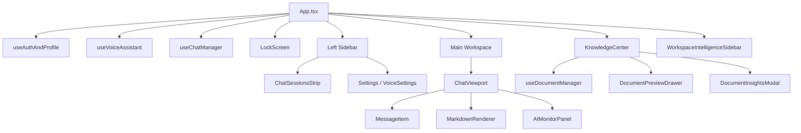
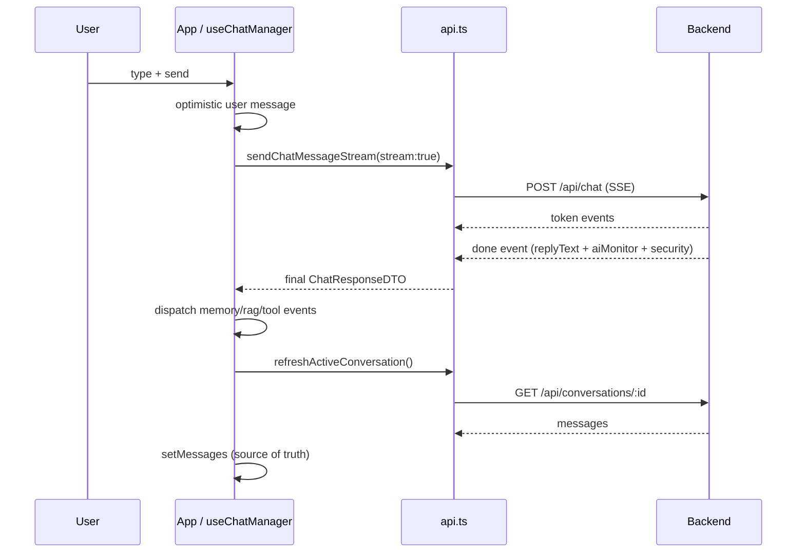

# Frontend Documentation

This document describes the React frontend of **Noryx**: component hierarchy, application state, streaming UI, conversation flow, Workspace Intelligence, Knowledge Center, AI Monitor, Voice, and Lock Screen.

- System overview: [../Architecture/SYSTEM_ARCHITECTURE.md](../Architecture/SYSTEM_ARCHITECTURE.md)
- API client: [../Reference/API.md](../Reference/API.md)
- Backend: [../Backend/BACKEND.md](../Backend/BACKEND.md)

---

## 1. Component hierarchy

The root `App.tsx` composes three hooks (`useAuthAndProfile`, `useVoiceAssistant`, `useChatManager`) and renders the layout: left sidebar, main chat workspace, Knowledge Center panel (right), and Workspace Intelligence sidebar (right, draggable toggle).

---

## 2. Application state

State is **hook-centric**. The backend is the single source of truth; hooks fetch from the API and never persist messages/documents locally.

| Hook | Owns | Key state |
|------|------|-----------|
| `useAuthAndProfile` | Auth, persona, security config, lock state | `currentUser`, `persona`, `securityConfig`, `isAppLocked` |
| `useVoiceAssistant` | Voice capture + speech | `isListening`, `voiceSpeechEnabled`, `handsFreeMode`, `selectedVoiceId` |
| `useChatManager` | Conversations + messages | `conversations`, `activeConversationId`, `messages`, `loading`, `aiMonitorData` |
| `useDocumentManager` | Documents | `documents`, `activeDocumentId`, `isUploading`, `indexingStatus` |

UI-only state (panel open/closed, drag position, onboarding) lives in `App.tsx` with `localStorage` persistence.

---

## 3. Streaming UI

- `useChatManager.sendMessageToBot` always uses `sendChatMessageStream` (SSE).
- The user message is added **optimistically** to the UI; the assistant message is rendered after the stream completes.
- Per-token `onToken` callbacks are currently no-ops because the UI reloads the full conversation from the backend after the stream ends (`refreshActiveConversation`). This keeps the UI consistent with the server.
- `loading` shows a typing/skeleton state; `AIMonitorPanel` renders inline with the assistant response.

---

## 4. Conversation flow

- If no active conversation exists, one is created on the fly.
- On error, a fallback message is shown and the voice callback still fires.

---

## 5. Workspace Intelligence

`WorkspaceIntelligenceSidebar.tsx` is the observability surface.

- Polls `GET /api/system/health` every 45s (`REFRESH_INTERVAL_MS`).
- Renders tri-state health for backend, providers (groq/gemini/ollama), database, chromadb, embeddings, memory, rag.
- Shows the latest `aiMonitorData` (provider, latency, mode, memory/RAG/tool metrics, security).
- **Auto-expand**: listens for `CustomEvent`s (`memory-retrieved`, `rag-retrieval`, `tool-executed`, `document-uploaded`, `system-degraded`) and opens the panel, with a 5-minute per-category cooldown stored in `localStorage`.
- A draggable floating button (`buttonY` persisted) opens the panel on click (distinguishing click from drag via a 5px threshold).

---

## 6. Knowledge Center

`KnowledgeCenter.tsx` + `useDocumentManager`:

- Lists documents from `GET /api/rag/documents`.
- Upload via `POST /api/rag/upload` (multipart `file`), with drag-and-drop and progress.
- Preview (`DocumentPreviewDrawer`), AI insights (`DocumentInsightsModal` → `POST /api/rag/summarize/:id`).
- Delete (`DELETE /api/rag/documents/:id`), reindex (`POST /api/rag/documents/:id/reindex`).
- "Attach" sets active documents for the current conversation so RAG scopes to them.
- Dispatches `document-uploaded` to trigger Workspace Intelligence auto-expand.

---

## 7. AI Monitor

`AIMonitorPanel.tsx` renders the `AIMonitorDTO` returned with each chat response:

- Collapsed: compact telemetry bar (provider, latency, mode).
- Expanded: metric cards for memory (entry count, avg confidence), RAG (active docs, chunks), tools (names), and a **Security** card (input/output decision chips, prompt-injection attempts, rejected files, rate-limited).
- Uses `useDialogA11y` for accessible expand/collapse.

---

## 8. Voice

`useVoiceAssistant.ts` + `LockScreen.tsx` + `voice-utils.ts`:

- **Input**: Web Speech API `SpeechRecognition` transcribes speech → `onSpeechResult` → `sendMessageToBot(text, undefined, isVoice=true)`.
- **Output**: `SpeechSynthesis` (browser-native) reads replies aloud; `autoReadReplies` and `handsFreeMode` control behaviour.
- **Gemini** voice type is selectable but falls back to native when quota is exceeded (`geminiQuotaExceeded`).
- Voice is transparent to the backend — it only sets `isVoice: true` so the model gets a request-scoped hint.

---

## 9. Lock Screen

`LockScreen.tsx` is a security gate rendered when `isAppLocked && securityConfig.securityEnabled`.

- Two unlock modes: **PIN** (`securityConfig.pin`) and **Voice passphrase** (`securityConfig.voicePassphrase`).
- Voice mode auto-starts recognition on load; on success it speaks a welcome (`firstName`).
- On unlock, `setIsAppLocked(false)` reveals the main app.
- All security config is supplied from `useAuthAndProfile` (Firebase-backed profile).

---

## 10. Key files reference

| File | Role |
|------|------|
| `src/App.tsx` | Root component, layout, hook composition, panel state. |
| `src/lib/api.ts` | Centralised `fetch` client; all endpoint URLs + SSE parsing. |
| `src/hooks/useChatManager.ts` | Conversation + message state, send/stream logic. |
| `src/hooks/useDocumentManager.ts` | Document state, upload/delete/reindex. |
| `src/hooks/useVoiceAssistant.ts` | Speech recognition + synthesis. |
| `src/hooks/useAuthAndProfile.ts` | Firebase auth, persona, security config, lock. |
| `src/components/ChatViewport.tsx` | Message list, input bar, voice controls. |
| `src/components/KnowledgeCenter.tsx` | Document management UI. |
| `src/components/WorkspaceIntelligenceSidebar.tsx` | Observability sidebar. |
| `src/components/AIMonitorPanel.tsx` | Per-response AI telemetry card. |
| `src/components/LockScreen.tsx` | PIN/voice security gate. |